## 新建史诗（hybrid）工具栏 <!-- {docsify-ignore-all} -->

   在混合看板新建工作项时，添加entry_id

### 处理过程

```plantuml
@startuml
hide footbox
<style>
root {
  HyperlinkColor #42b983
}
</style>

hide empty description
state "开始" as Begin <<start>> [[$./new_hybrid_kanban_epic_toolbar#begin {开始}]]
state "设置第一个看板栏id" as PREPAREJSPARAM1  [[$./new_hybrid_kanban_epic_toolbar#preparejsparam1 {设置第一个看板栏id}]]
state "新建史诗（hybrid）" as DEUIACTION1  [[$./new_hybrid_kanban_epic_toolbar#deuiaction1 {新建史诗（hybrid）}]]


Begin --> PREPAREJSPARAM1
PREPAREJSPARAM1 --> DEUIACTION1


@enduml
```

### 处理步骤说明

#### 开始 :id=Begin [开始]

#### 设置第一个看板栏id :id=PREPAREJSPARAM1 [准备参数]

1. 将`kanban.groupCodeListItems[0].value` 设置给  `Default(传入变量).srfgroup`

#### 新建史诗（hybrid） :id=DEUIACTION1 [实体界面行为调用]

调用实体 [工作项(WORK_ITEM)](module/ProjMgmt/work_item.md) 界面行为 [新建史诗（hybrid动态）](module/ProjMgmt/work_item#界面行为) ，行为参数为`Default(传入变量)`

### 实体逻辑参数

|    中文名   |    代码名    |  数据类型      |备注 |
| --------| --------| --------  | --------   |
|传入变量(<i class="fa fa-check"/></i>)|Default|数据对象||
|kanban|kanban|部件对象||
