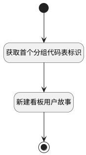

## 新建用户故事（kanban）（工具栏） <!-- {docsify-ignore-all} -->

   获取首个代码表标识，并新建看板用户故事

### 处理过程

### 处理步骤说明

#### 开始 :id=Begin [开始]

#### 结束 :id=END1 [结束]

#### 获取首个分组代码表标识 :id=PREPAREJSPARAM1 [准备参数]

1. 将`kanban(看板).groupCodeListItems[0].value` 设置给  `Default(传入变量).srfgroup`

#### 新建看板用户故事 :id=DEUIACTION1 [实体界面行为调用]

调用实体 [工作项(WORK_ITEM)](module/ProjMgmt/work_item.md) 界面行为 [新建用户故事（kanban动态）](module/ProjMgmt/work_item#界面行为) ，行为参数为`Default(传入变量)`

### 实体逻辑参数

|    中文名   |    代码名    |  数据类型      |备注 |
| --------| --------| --------  | --------   |
|看板|kanban|部件对象||
|传入变量(<i class="fa fa-check"/></i>)|Default|数据对象||
