## 新建行 <!-- {docsify-ignore-all} -->

   树状表格新建子工作项

### 处理过程

```plantuml
@startuml
hide footbox
<style>
root {
  HyperlinkColor #42b983
}
</style>

hide empty description
state "开始" as Begin <<start>> [[$./newrow_test#begin {开始}]]
state "计算子工作项类型" as DEUIACTION1  [[$./newrow_test#deuiaction1 {计算子工作项类型}]]
state "结束" as END1 <<end>> [[$./newrow_test#end1 {结束}]]
state "注入脚本代码" as RAWJSCODE1  [[$./newrow_test#rawjscode1 {注入脚本代码}]]


Begin --> DEUIACTION1
DEUIACTION1 --> RAWJSCODE1
RAWJSCODE1 --> END1


@enduml
```




### 处理步骤说明

#### 开始 :id=Begin<sup class="footnote-symbol"> <font color=gray size=1>[开始]</font></sup>


#### 计算子工作项类型 :id=DEUIACTION1<sup class="footnote-symbol"> <font color=gray size=1>[实体界面行为调用]</font></sup>


调用实体 [工作项(WORK_ITEM)](module/ProjMgmt/work_item.md) 界面行为 [计算子工作项类型](module/ProjMgmt/work_item#界面行为) ，行为参数为`Default(传入变量)`

#### 注入脚本代码 :id=RAWJSCODE1<sup class="footnote-symbol"> <font color=gray size=1>[直接前台代码]</font></sup>


<p class="panel-title"><b>执行代码</b></p>

```javascript
const treegrid = view.getController('treegrid');
if (treegrid) {
    treegrid.newRow({data: uiLogic.default});
}
```

#### 结束 :id=END1<sup class="footnote-symbol"> <font color=gray size=1>[结束]</font></sup>


### 实体逻辑参数

|    中文名   |    代码名    |  数据类型      |备注 |
| --------| --------| --------  | --------   |
|传入变量(<i class="fa fa-check"/></i>)|Default|数据对象||
