## 打开BI报表设计界面 <!-- {docsify-ignore-all} -->

   打开bi报表设计界面，后续需删除

### 处理过程

```plantuml
@startuml
hide footbox
<style>
root {
  HyperlinkColor #42b983
}
</style>

hide empty description
state "开始" as Begin <<start>> [[$./open_bi_report_design#begin {开始}]]
state "注入脚本代码" as RAWJSCODE1  [[$./open_bi_report_design#rawjscode1 {注入脚本代码}]]
state "结束" as END1 <<end>> [[$./open_bi_report_design#end1 {结束}]]


Begin --> RAWJSCODE1
RAWJSCODE1 --> END1


@enduml
```




### 处理步骤说明

#### 开始 :id=Begin<sup class="footnote-symbol"> <font color=gray size=1>[开始]</font></sup>


#### 注入脚本代码 :id=RAWJSCODE1<sup class="footnote-symbol"> <font color=gray size=1>[直接前台代码]</font></sup>


<p class="panel-title"><b>执行代码</b></p>

```javascript
if(uiLogic.reportpanel){
    uiLogic.result = await uiLogic.reportpanel.openReportDesignPage();
}else{
    uiLogic.result = await uiLogic.reportpanel_portlet.contentController.openReportDesignPage();
}

```

#### 结束 :id=END1<sup class="footnote-symbol"> <font color=gray size=1>[结束]</font></sup>


### 实体逻辑参数

|    中文名   |    代码名    |  数据类型      |备注 |
| --------| --------| --------  | --------   |
|报表面板门户部件|reportpanel_portlet|当前部件对象||
|传入变量(<i class="fa fa-check"/></i>)|Default|数据对象||
|报表面板|reportpanel|部件对象||
|返回结果对象|result|数据对象||
