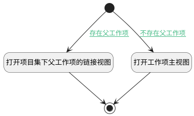

## 项目集打开父工作项 <!-- {docsify-ignore-all} -->

   项目集中父工作项列触发逻辑：打开父工作项主视图

### 处理过程




### 处理步骤说明

#### 开始 :id=Begin<sup class="footnote-symbol"> <font color=gray size=1>[开始]</font></sup>


#### 打开项目集下父工作项的链接视图 :id=DEUIACTION1<sup class="footnote-symbol"> <font color=gray size=1>[实体界面行为调用]</font></sup>


调用实体 [工作项(WORK_ITEM)](module/ProjMgmt/work_item.md) 界面行为 [打开项目集下父工作项的链接视图](module/ProjMgmt/work_item#界面行为) ，行为参数为`Default(传入变量)`

#### 打开工作项主视图 :id=DEUIACTION2<sup class="footnote-symbol"> <font color=gray size=1>[实体界面行为调用]</font></sup>


调用实体 [工作项(WORK_ITEM)](module/ProjMgmt/work_item.md) 界面行为 [打开工作项主视图](module/ProjMgmt/work_item#界面行为) ，行为参数为`Default(传入变量)`

#### 结束 :id=END1<sup class="footnote-symbol"> <font color=gray size=1>[结束]</font></sup>


### 连接条件说明
#### 存在父工作项 :id=Begin-DEUIACTION1

```Default(传入变量).pid``` ISNOTNULL
#### 不存在父工作项 :id=Begin-DEUIACTION2

```Default(传入变量).pid``` ISNULL


### 实体逻辑参数

|    中文名   |    代码名    |  数据类型      |备注 |
| --------| --------| --------  | --------   |
|应用上下文变量|context|导航视图参数绑定参数||
|传入变量(<i class="fa fa-check"/></i>)|Default|数据对象||
