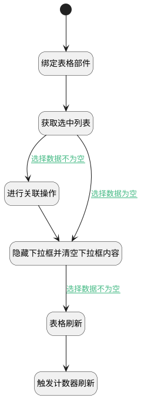

## 工作项关联工作项值变更 <!-- {docsify-ignore-all} -->

   工作项关联工作项值变更时，调用处理逻辑，生成正反向关联数据

### 处理过程




### 处理步骤说明

#### 开始 :id=Begin<sup class="footnote-symbol"> <font color=gray size=1>[开始]</font></sup>


#### 绑定表格部件 :id=PREPAREJSPARAM1<sup class="footnote-symbol"> <font color=gray size=1>[准备参数]</font></sup>


1. 将`view(视图对象).layoutPanel.panelItems.grid.control` 设置给  `grid(表格对象)`

#### 获取选中列表 :id=RAWJSCODE2<sup class="footnote-symbol"> <font color=gray size=1>[直接前台代码]</font></sup>


<p class="panel-title"><b>执行代码</b></p>

```javascript
let choose = uiLogic.default.choose_relation_data;
let choose_type = view.layoutPanel.panelItems.choose_type.value;
if (choose != null && choose != '') {
    uiLogic.dto.srfactionparam = JSON.parse(choose);
    uiLogic.dto.principal_id = view.context.principal_id;
    uiLogic.dto.principal_type = view.context.principal_type;
    uiLogic.dto.target_type = view.context.target_type;
    uiLogic.viewctx.project = view.context.curproject;
}
// 关联类型
if (choose_type != null && choose_type != '') {
    uiLogic.dto.relation_type = choose_type;
}
```

#### 进行关联操作 :id=DEACTION1<sup class="footnote-symbol"> <font color=gray size=1>[实体行为]</font></sup>


调用实体 [工作项(WORK_ITEM)](module/ProjMgmt/work_item.md) 行为 [其他实体关联工作项(others_relation_work_item)](module/ProjMgmt/work_item#行为) ，行为参数为`dto(传入后台对象)`

#### 隐藏下拉框并清空下拉框内容 :id=RAWJSCODE1<sup class="footnote-symbol"> <font color=gray size=1>[直接前台代码]</font></sup>


<p class="panel-title"><b>执行代码</b></p>

```javascript
const choose_relation_data = view.layoutPanel.panelItems.choose_relation_data;
const panel = view.layoutPanel.panelItems.choose_data;
if (choose_relation_data) {
    panel.state.visible = false;
}
uiLogic.default.choose_relation_data = null;
```

#### 表格刷新 :id=VIEWCTRLINVOKE1<sup class="footnote-symbol"> <font color=gray size=1>[视图部件调用]</font></sup>


调用`grid(表格对象)`的方法`refresh`，参数为`Default(传入变量)`
#### 触发计数器刷新 :id=RAWJSCODE3<sup class="footnote-symbol"> <font color=gray size=1>[直接前台代码]</font></sup>


<p class="panel-title"><b>执行代码</b></p>

```javascript
ibiz.mc.command.update.send({ srfdecodename: context.principal_type})
```

### 连接条件说明
#### 选择数据不为空 :id=RAWJSCODE2-DEACTION1

```dto(传入后台对象).srfactionparam``` ISNOTNULL
#### 选择数据不为空 :id=RAWJSCODE1-VIEWCTRLINVOKE1

```dto(传入后台对象).srfactionparam``` ISNOTNULL
#### 选择数据为空 :id=RAWJSCODE2-RAWJSCODE1

```dto(传入后台对象).srfactionparam``` ISNULL


### 实体逻辑参数

|    中文名   |    代码名    |  数据类型      |备注 |
| --------| --------| --------  | --------   |
|表格对象|grid|部件对象||
|传入变量(<i class="fa fa-check"/></i>)|Default|数据对象||
|视图对象|view|当前视图对象||
|viewctx|viewctx|导航视图参数绑定参数||
|传入后台对象|dto|数据对象||
