## 设置时间范围 <!-- {docsify-ignore-all} -->

   自动获取指定指定时间范围时间，并返回至搜索表单

### 处理过程

```plantuml
@startuml
hide footbox
<style>
root {
  HyperlinkColor #42b983
}
</style>

hide empty description
state "开始" as Begin <<start>> [[$./set_date_range#begin {开始}]]
state "结束" as END1 <<end>> [[$./set_date_range#end1 {结束}]]
state "注入脚本代码" as RAWJSCODE1  [[$./set_date_range#rawjscode1 {注入脚本代码}]]


Begin --> RAWJSCODE1
RAWJSCODE1 --> END1


@enduml
```




### 处理步骤说明

#### 开始 :id=Begin<sup class="footnote-symbol"> <font color=gray size=1>[开始]</font></sup>


#### 结束 :id=END1<sup class="footnote-symbol"> <font color=gray size=1>[结束]</font></sup>


#### 注入脚本代码 :id=RAWJSCODE1<sup class="footnote-symbol"> <font color=gray size=1>[直接前台代码]</font></sup>


<p class="panel-title"><b>执行代码</b></p>

```javascript
view.ctx.evt.on('onRegister', (name, c) => {
    if(name==='searchform'){
        const time = new Date();
        const preTime = new Date(time.getTime() - 604800000);
        const n_create_time_gtandeq = preTime.getFullYear() +'-' +(preTime.getMonth() + 1 < 10 ? '0' + (preTime.getMonth() + 1): preTime.getMonth() + 1) +'-' +(preTime.getDate() < 10 ? '0' + preTime.getDate() : preTime.getDate()) 
        const n_create_time_ltandeq = time.getFullYear() +'-' +(time.getMonth() + 1 < 10 ? '0' + (time.getMonth() + 1): time.getMonth() + 1) +'-' +(time.getDate() < 10 ? '0' + time.getDate() : time.getDate())
        const date_range = n_create_time_gtandeq + ',' + n_create_time_ltandeq;
        Object.assign(c.params, {n_create_time_gtandeq,n_create_time_ltandeq,date_range})
    }
});
```


### 实体逻辑参数

|    中文名   |    代码名    |  数据类型      |备注 |
| --------| --------| --------  | --------   |
|传入变量(<i class="fa fa-check"/></i>)|Default|数据对象||
