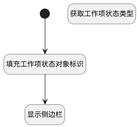

## 显示表单侧边栏 <!-- {docsify-ignore-all} -->

   每次工作项主表单刷新时，将右侧侧边栏默认显示出来。

### 处理过程




### 处理步骤说明

#### 获取工作项状态类型 :id=DEACTION1<sup class="footnote-symbol"> <font color=gray size=1>[实体行为]</font></sup>


调用实体 [工作项状态(WORK_ITEM_STATE)](module/ProjMgmt/work_item_state.md) 行为 [Get](module/ProjMgmt/work_item_state#行为) ，行为参数为`work_item_state(工作项状态对象)`

将执行结果返回给参数`work_item_state(工作项状态对象)`

#### 开始 :id=Begin<sup class="footnote-symbol"> <font color=gray size=1>[开始]</font></sup>


#### 填充工作项状态对象标识 :id=PREPAREJSPARAM1<sup class="footnote-symbol"> <font color=gray size=1>[准备参数]</font></sup>


1. 将`view(视图).layoutPanel.panelItems.form.control.state.data.state` 设置给  `work_item_state(工作项状态对象).id`
2. 将`work_item_state(工作项状态对象).id` 设置给  `ctx(上下文).work_item_state`

#### 显示侧边栏 :id=RAWJSCODE1<sup class="footnote-symbol"> <font color=gray size=1>[直接前台代码]</font></sup>


<p class="panel-title"><b>执行代码</b></p>

```javascript
uiLogic.view.ctx.controllersMap.get("form").details.grouppanel8.state.visible=true;
//var state_type = uiLogic.work_item_state.type;
//uiLogic.view.layoutPanel.panelItems.form.control.details.state_type.setDataValue(state_type);


```


### 实体逻辑参数

|    中文名   |    代码名    |  数据类型      |备注 |
| --------| --------| --------  | --------   |
|传入变量(<i class="fa fa-check"/></i>)|Default|数据对象||
|工作项状态对象|work_item_state|数据对象||
|上下文|ctx|导航视图参数绑定参数||
|视图|view|当前视图对象||
