## 显示表单侧边栏 <!-- {docsify-ignore-all} -->

   每次工作项主表单刷新时，将右侧侧边栏默认显示出来。

### 处理过程

```plantuml
@startuml
hide footbox
<style>
root {
  HyperlinkColor #42b983
}
</style>

hide empty description
state "开始" as Begin <<start>> [[$./show_form_sidebar#begin {开始}]]
state "显示侧边栏" as RAWJSCODE1  [[$./show_form_sidebar#rawjscode1 {显示侧边栏}]]


Begin --> RAWJSCODE1


@enduml
```




### 处理步骤说明

#### 开始 :id=Begin<sup class="footnote-symbol"> <font color=gray size=1>[开始]</font></sup>


#### 显示侧边栏 :id=RAWJSCODE1<sup class="footnote-symbol"> <font color=gray size=1>[直接前台代码]</font></sup>


<p class="panel-title"><b>执行代码</b></p>

```javascript
uiLogic.view.ctx.controllersMap.get("form").details.grouppanel8.state.visible=true;

```


### 实体逻辑参数

|    中文名   |    代码名    |  数据类型      |备注 |
| --------| --------| --------  | --------   |
|上下文|ctx|导航视图参数绑定参数||
|传入变量(<i class="fa fa-check"/></i>)|Default|数据对象||
|视图|view|当前视图对象||
