## 上传附件（工具栏） <!-- {docsify-ignore-all} -->

   工具栏按钮触发上传附件功能

### 处理过程

```plantuml
@startuml
hide footbox
<style>
root {
  HyperlinkColor #42b983
}
</style>

hide empty description
state "开始" as Begin <<start>> [[$./toolbar_add_attachment#begin {开始}]]
state "添加附件" as DEUIACTION1  [[$./toolbar_add_attachment#deuiaction1 {添加附件}]]
state "上传附件（工具栏）" as RAWJSCODE1  [[$./toolbar_add_attachment#rawjscode1 {上传附件（工具栏）}]]


Begin --> RAWJSCODE1
RAWJSCODE1 --> DEUIACTION1


@enduml
```




### 处理步骤说明

#### 开始 :id=Begin<sup class="footnote-symbol"> <font color=gray size=1>[开始]</font></sup>


#### 上传附件（工具栏） :id=RAWJSCODE1<sup class="footnote-symbol"> <font color=gray size=1>[直接前台代码]</font></sup>


<p class="panel-title"><b>执行代码</b></p>

```javascript
uiLogic.form.details.tabpanel1.state.activeTab = 'tabpage1'
```

#### 添加附件 :id=DEUIACTION1<sup class="footnote-symbol"> <font color=gray size=1>[实体界面行为调用]</font></sup>


调用实体 [工作项(WORK_ITEM)](module/ProjMgmt/work_item.md) 界面行为 [添加附件](module/ProjMgmt/work_item#界面行为) 


### 实体逻辑参数

|    中文名   |    代码名    |  数据类型      |备注 |
| --------| --------| --------  | --------   |
|表单|form|部件对象||
|视图|view|当前视图对象||
|传入变量(<i class="fa fa-check"/></i>)|Default|数据对象||
