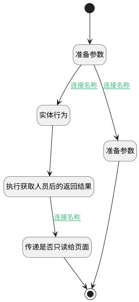

## 工作项只读用户判断 <!-- {docsify-ignore-all} -->

   判断当前用户是否为只读用户，调用后台处理逻辑获取当前项目成员并判断返回

### 处理过程




### 处理步骤说明

#### 实体行为 :id=DEACTION1<sup class="footnote-symbol"> <font color=gray size=1>[实体行为]</font></sup>


调用实体 [工作项(WORK_ITEM)](module/ProjMgmt/work_item.md) 行为 [工作项只读用户判断(work_item_readonly_recognize)](module/ProjMgmt/work_item#行为) ，行为参数为`Default(传入变量)`

将执行结果返回给参数`Default(传入变量)`

#### 执行获取人员后的返回结果 :id=DEBUGPARAM1<sup class="footnote-symbol"> <font color=gray size=1>[调试逻辑参数]</font></sup>


> [!NOTE|label:调试信息|icon:fa fa-bug]
> 调试输出参数`传入变量`的详细信息

#### 传递是否只读给页面 :id=PREPAREJSPARAM2<sup class="footnote-symbol"> <font color=gray size=1>[准备参数]</font></sup>


1. 将`true` 设置给  `viewctx(上下文).srfreadonly`

#### 开始 :id=Begin<sup class="footnote-symbol"> <font color=gray size=1>[开始]</font></sup>


#### 结束 :id=END1<sup class="footnote-symbol"> <font color=gray size=1>[结束]</font></sup>


#### 准备参数 :id=PREPAREJSPARAM3<sup class="footnote-symbol"> <font color=gray size=1>[准备参数]</font></sup>


1. 将`view.params` 绑定给  `view_params(视图参数)`

#### 准备参数 :id=PREPAREJSPARAM4<sup class="footnote-symbol"> <font color=gray size=1>[准备参数]</font></sup>


1. 将`true` 设置给  `viewctx(上下文).srfreadonly`

### 连接条件说明
#### 连接名称 :id=PREPAREJSPARAM3-DEACTION1

```view_params(视图参数).srfversionid``` ISNULL
#### 连接名称 :id=DEBUGPARAM1-PREPAREJSPARAM2

```Default(传入变量).readonly``` EQ ```true```
#### 连接名称 :id=PREPAREJSPARAM3-PREPAREJSPARAM4

```view_params(视图参数).srfversionid``` ISNOTNULL


### 实体逻辑参数

|    中文名   |    代码名    |  数据类型      |备注 |
| --------| --------| --------  | --------   |
|传入变量(<i class="fa fa-check"/></i>)|Default|数据对象||
|成员信息|members|分页查询||
|view|view|当前视图对象||
|过滤器|filter|过滤器||
|工单信息|ticket_info|数据对象||
|应用对象|app_obj|应用程序变量||
|产品信息|product|数据对象||
|上下文|viewctx|导航视图参数绑定参数||
|视图参数|view_params|数据对象||
