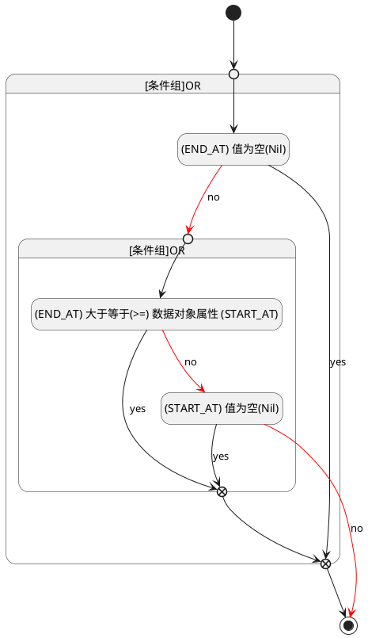

## 结束时间(END_AT) <!-- {docsify-ignore-all} -->

   

### 结束时间 :id=END_AT

#### 条件说明

##### (END_AT) 大于等于(>=) 数据对象属性 (START_AT) :id=a0fe6d7dff859b56f632c433382413b23

`END_AT(结束时间)` GTANDEQ  `START_AT`

> [!ATTENTION|label:规则信息|icon:fa fa-warning]
> 结束时间必须大于等于开始时间

##### (START_AT) 值为空(Nil) :id=a61fffc61ace48ed7076e14224c3ba06a

`START_AT(开始时间)` ISNULL 

##### (END_AT) 值为空(Nil) :id=ab5e07e188578bcd4e28abb3381abc600

`END_AT(结束时间)` ISNULL 

