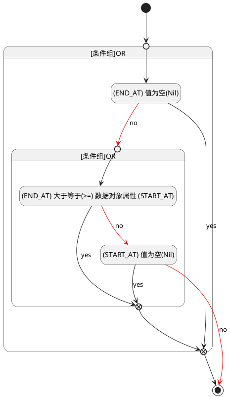

## 截止时间(END_AT) <!-- {docsify-ignore-all} -->

   

### 结束时间 :id=END_AT

#### 条件说明

##### (END_AT) 值为空(Nil) :id=a696d0846a380b54d0048127790c2dcf9

`END_AT(截止时间)` ISNULL 

##### (START_AT) 值为空(Nil) :id=a5ac0a4b22fc29b503b4d916ce2dc466c

`START_AT(开始时间)` ISNULL 

##### (END_AT) 大于等于(>=) 数据对象属性 (START_AT) :id=a4101c802e396aac6f8d61fd5a715aa8a

`END_AT(截止时间)` GTANDEQ  `START_AT`

> [!ATTENTION|label:规则信息|icon:fa fa-warning]
> 结束时间必须大于等于开始时间

