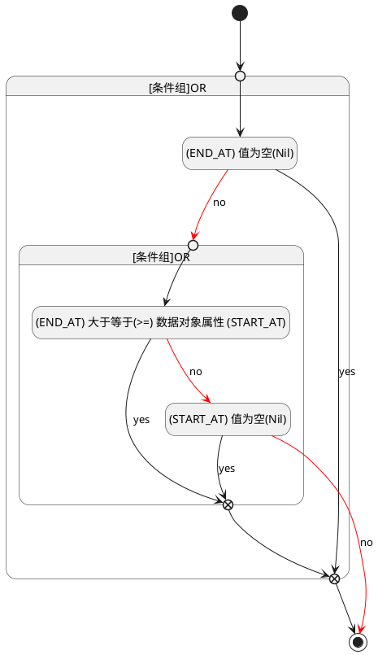

## 截止时间(END_AT) <!-- {docsify-ignore-all} -->

   

### 结束时间 :id=END_AT

#### 条件说明

##### (END_AT) 值为空(Nil) :id=ac6ad377c0aa2ede99279cab936d2be55

`END_AT(截止时间)` ISNULL 

##### (START_AT) 值为空(Nil) :id=a6c3388590f86a53ef6ad9c5e7c68d730

`START_AT(开始时间)` ISNULL 

##### (END_AT) 大于等于(>=) 数据对象属性 (START_AT) :id=a5a81e3c9e935ec665c63efe5d36c5b8e

`END_AT(截止时间)` GTANDEQ  `START_AT`

> [!ATTENTION|label:规则信息|icon:fa fa-warning]
> 结束时间必须大于等于开始时间

