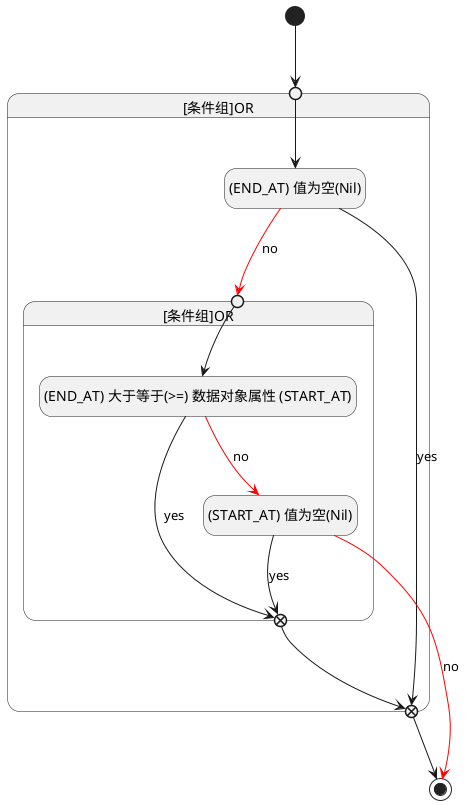

## 截止时间(END_AT) <!-- {docsify-ignore-all} -->

   

### 结束时间 :id=END_AT

#### 条件说明

##### (END_AT) 大于等于(>=) 数据对象属性 (START_AT) :id=aa11981f97548f83ad2642b9baa2bd560

`END_AT(截止时间)` GTANDEQ  `START_AT`

> [!ATTENTION|label:规则信息|icon:fa fa-warning]
> 结束时间必须大于等于开始时间

##### (START_AT) 值为空(Nil) :id=a26361545a1e81a21f9c1ea5357c915e0

`START_AT(开始时间)` ISNULL 

##### (END_AT) 值为空(Nil) :id=a0bcb100fcfbcd025b629c30d6fb79372

`END_AT(截止时间)` ISNULL 

