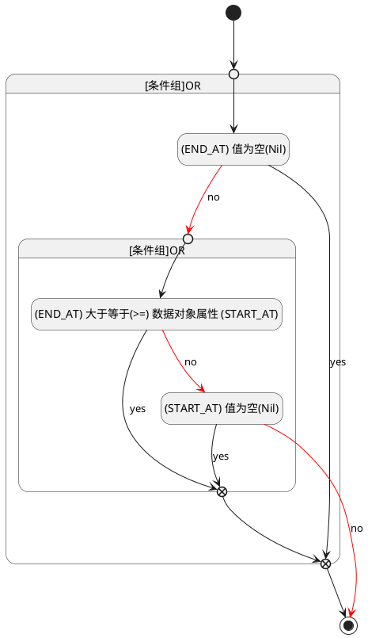

## 截止时间(END_AT) <!-- {docsify-ignore-all} -->

   

### 结束时间 :id=END_AT

#### 条件说明

##### (END_AT) 值为空(Nil) :id=a730191594ef670b95f1ba7c86b37895b

`END_AT(截止时间)` ISNULL 

##### (START_AT) 值为空(Nil) :id=a767c2a6f34ddb1fef25a7c609e867801

`START_AT(开始时间)` ISNULL 

##### (END_AT) 大于等于(>=) 数据对象属性 (START_AT) :id=af23a0d20a8e86165f30b7d07c34269cf

`END_AT(截止时间)` GTANDEQ  `START_AT`

> [!ATTENTION|label:规则信息|icon:fa fa-warning]
> 结束时间必须大于等于开始时间

