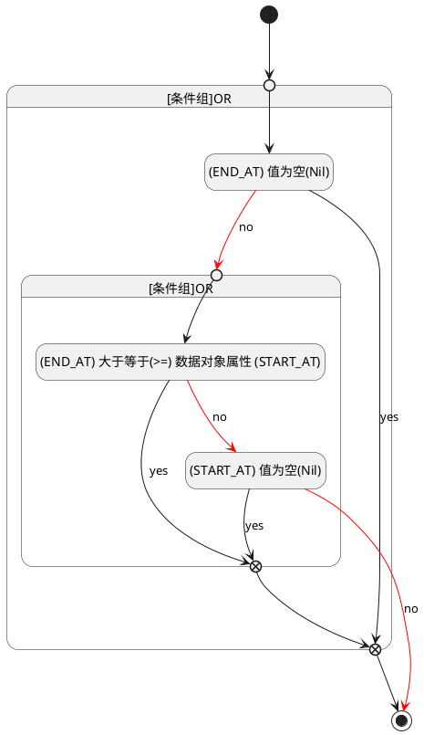

## 截止时间(END_AT) <!-- {docsify-ignore-all} -->

   

### 结束时间 :id=END_AT

```plantuml
@startuml
hide empty description
<style>
root {
  HyperlinkColor #42b983
}
</style>

state "start" as start  <<start>>
state "end" as end <<end>>
state "[条件组]OR" as a9553264e7c21b7b5fd6294359efb4d2 [[$./end_at#aa9553264e7c21b7b5fd6294359efb4d2 {"[条件组]OR"}]] {
state " " as a9553264e7c21b7b5fd6294359efb4d2_entry  <<entryPoint>>
state "(END_AT) 值为空(Nil)" as 26361545a1e81a21f9c1ea5357c915e0 [[$./end_at#a26361545a1e81a21f9c1ea5357c915e0 {"[常规条件] 值为空(Nil)"}]]
state "[条件组]OR" as 544d05a183964a6eedd7a50ff4bf68b5 [[$./end_at#a544d05a183964a6eedd7a50ff4bf68b5 {"[条件组]OR"}]] {
state " " as 544d05a183964a6eedd7a50ff4bf68b5_entry  <<entryPoint>>
state "(END_AT) 大于等于(>=) 数据对象属性 (START_AT)" as 131be708e5222b53f847b2d2d8448847 [[$./end_at#a131be708e5222b53f847b2d2d8448847 {"[常规条件] 大于等于(>=) 数据对象属性 (START_AT)"}]]
state "(START_AT) 值为空(Nil)" as 9f5d7024e5688ce49d05e5d49ff30700 [[$./end_at#a9f5d7024e5688ce49d05e5d49ff30700 {"[常规条件] 值为空(Nil)"}]]
state " " as 544d05a183964a6eedd7a50ff4bf68b5_exit  <<exitPoint>>
}
state " " as a9553264e7c21b7b5fd6294359efb4d2_exit  <<exitPoint>>
}


start --> a9553264e7c21b7b5fd6294359efb4d2_entry 
a9553264e7c21b7b5fd6294359efb4d2_entry --> 26361545a1e81a21f9c1ea5357c915e0 
26361545a1e81a21f9c1ea5357c915e0 --> a9553264e7c21b7b5fd6294359efb4d2_exit  : yes
26361545a1e81a21f9c1ea5357c915e0 -[#red]-> 544d05a183964a6eedd7a50ff4bf68b5_entry  : no

544d05a183964a6eedd7a50ff4bf68b5_entry --> 131be708e5222b53f847b2d2d8448847 
131be708e5222b53f847b2d2d8448847 --> 544d05a183964a6eedd7a50ff4bf68b5_exit  : yes
131be708e5222b53f847b2d2d8448847 -[#red]-> 9f5d7024e5688ce49d05e5d49ff30700  : no

9f5d7024e5688ce49d05e5d49ff30700 --> 544d05a183964a6eedd7a50ff4bf68b5_exit  : yes
9f5d7024e5688ce49d05e5d49ff30700 -[#red]-> end  : no
544d05a183964a6eedd7a50ff4bf68b5_exit --> a9553264e7c21b7b5fd6294359efb4d2_exit 
a9553264e7c21b7b5fd6294359efb4d2_exit --> end 


@enduml
```

#### 条件说明

##### (START_AT) 值为空(Nil) :id=a9f5d7024e5688ce49d05e5d49ff30700

`START_AT(开始时间)` ISNULL 

##### (END_AT) 大于等于(>=) 数据对象属性 (START_AT) :id=a131be708e5222b53f847b2d2d8448847

`END_AT(截止时间)` GTANDEQ  `START_AT`

> [!ATTENTION|label:规则信息|icon:fa fa-warning]
> 结束时间必须大于等于开始时间

##### (END_AT) 值为空(Nil) :id=a26361545a1e81a21f9c1ea5357c915e0

`END_AT(截止时间)` ISNULL 

