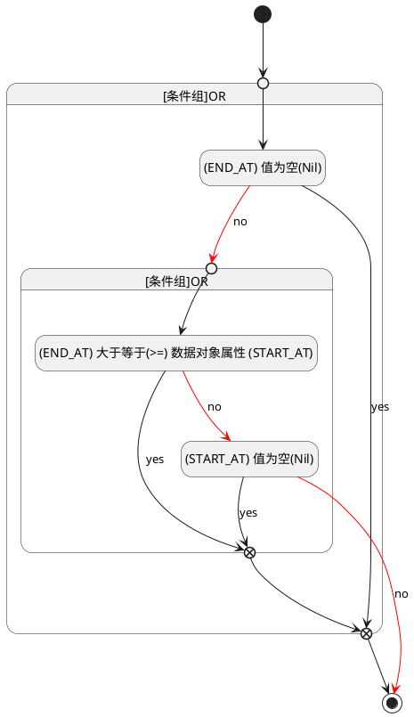

## 截止时间(END_AT) <!-- {docsify-ignore-all} -->

   

### 结束时间 :id=END_AT

```plantuml
@startuml
hide empty description
<style>
root {
  HyperlinkColor #42b983
}
</style>

state "start" as start  <<start>>
state "end" as end <<end>>
state "[条件组]OR" as ae79a768d3b658f53c17897a009b2633 [[$./end_at#aae79a768d3b658f53c17897a009b2633 {"[条件组]OR"}]] {
state " " as ae79a768d3b658f53c17897a009b2633_entry  <<entryPoint>>
state "(END_AT) 值为空(Nil)" as f6ceeadc9a78e472f6f7675c2afe7133 [[$./end_at#af6ceeadc9a78e472f6f7675c2afe7133 {"[常规条件] 值为空(Nil)"}]]
state "[条件组]OR" as 2a12e363f9e3b1a8398011019d1a791a [[$./end_at#a2a12e363f9e3b1a8398011019d1a791a {"[条件组]OR"}]] {
state " " as 2a12e363f9e3b1a8398011019d1a791a_entry  <<entryPoint>>
state "(END_AT) 大于等于(>=) 数据对象属性 (START_AT)" as 9056009030960448826022fdb64e9731 [[$./end_at#a9056009030960448826022fdb64e9731 {"[常规条件] 大于等于(>=) 数据对象属性 (START_AT)"}]]
state "(START_AT) 值为空(Nil)" as fc36b8f8922a90833d278f1d6d8636be [[$./end_at#afc36b8f8922a90833d278f1d6d8636be {"[常规条件] 值为空(Nil)"}]]
state " " as 2a12e363f9e3b1a8398011019d1a791a_exit  <<exitPoint>>
}
state " " as ae79a768d3b658f53c17897a009b2633_exit  <<exitPoint>>
}


start --> ae79a768d3b658f53c17897a009b2633_entry 
ae79a768d3b658f53c17897a009b2633_entry --> f6ceeadc9a78e472f6f7675c2afe7133 
f6ceeadc9a78e472f6f7675c2afe7133 --> ae79a768d3b658f53c17897a009b2633_exit  : yes
f6ceeadc9a78e472f6f7675c2afe7133 -[#red]-> 2a12e363f9e3b1a8398011019d1a791a_entry  : no

2a12e363f9e3b1a8398011019d1a791a_entry --> 9056009030960448826022fdb64e9731 
9056009030960448826022fdb64e9731 --> 2a12e363f9e3b1a8398011019d1a791a_exit  : yes
9056009030960448826022fdb64e9731 -[#red]-> fc36b8f8922a90833d278f1d6d8636be  : no

fc36b8f8922a90833d278f1d6d8636be --> 2a12e363f9e3b1a8398011019d1a791a_exit  : yes
fc36b8f8922a90833d278f1d6d8636be -[#red]-> end  : no
2a12e363f9e3b1a8398011019d1a791a_exit --> ae79a768d3b658f53c17897a009b2633_exit 
ae79a768d3b658f53c17897a009b2633_exit --> end 


@enduml
```

#### 条件说明

##### (END_AT) 值为空(Nil) :id=af6ceeadc9a78e472f6f7675c2afe7133

`END_AT(截止时间)` ISNULL 

##### (END_AT) 大于等于(>=) 数据对象属性 (START_AT) :id=a9056009030960448826022fdb64e9731

`END_AT(截止时间)` GTANDEQ  `START_AT`

> [!ATTENTION|label:规则信息|icon:fa fa-warning]
> 结束时间必须大于等于开始时间

##### (START_AT) 值为空(Nil) :id=afc36b8f8922a90833d278f1d6d8636be

`START_AT(开始时间)` ISNULL 

