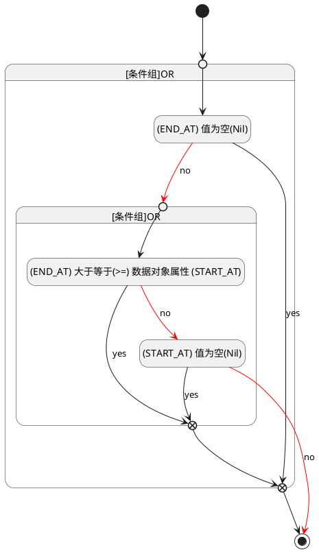

## 截止时间(END_AT) <!-- {docsify-ignore-all} -->

   

### 结束时间 :id=END_AT

```plantuml
@startuml
hide empty description
<style>
root {
  HyperlinkColor #42b983
}
</style>

state "start" as start  <<start>>
state "end" as end <<end>>
state "[条件组]OR" as 84bbfd29d3f3b9557455786ce74a6a11 [[$./end_at#a84bbfd29d3f3b9557455786ce74a6a11 {"[条件组]OR"}]] {
state " " as 84bbfd29d3f3b9557455786ce74a6a11_entry  <<entryPoint>>
state "(END_AT) 值为空(Nil)" as 9a16606e0bb5eb5b2313d64e8b64b750 [[$./end_at#a9a16606e0bb5eb5b2313d64e8b64b750 {"[常规条件] 值为空(Nil)"}]]
state "[条件组]OR" as 79c2e618328ad0cb267dde68e985ef19 [[$./end_at#a79c2e618328ad0cb267dde68e985ef19 {"[条件组]OR"}]] {
state " " as 79c2e618328ad0cb267dde68e985ef19_entry  <<entryPoint>>
state "(END_AT) 大于等于(>=) 数据对象属性 (START_AT)" as 56148d0e3e715f91ba89ddd41f8b290b [[$./end_at#a56148d0e3e715f91ba89ddd41f8b290b {"[常规条件] 大于等于(>=) 数据对象属性 (START_AT)"}]]
state "(START_AT) 值为空(Nil)" as c6ad377c0aa2ede99279cab936d2be55 [[$./end_at#ac6ad377c0aa2ede99279cab936d2be55 {"[常规条件] 值为空(Nil)"}]]
state " " as 79c2e618328ad0cb267dde68e985ef19_exit  <<exitPoint>>
}
state " " as 84bbfd29d3f3b9557455786ce74a6a11_exit  <<exitPoint>>
}


start --> 84bbfd29d3f3b9557455786ce74a6a11_entry 
84bbfd29d3f3b9557455786ce74a6a11_entry --> 9a16606e0bb5eb5b2313d64e8b64b750 
9a16606e0bb5eb5b2313d64e8b64b750 --> 84bbfd29d3f3b9557455786ce74a6a11_exit  : yes
9a16606e0bb5eb5b2313d64e8b64b750 -[#red]-> 79c2e618328ad0cb267dde68e985ef19_entry  : no

79c2e618328ad0cb267dde68e985ef19_entry --> 56148d0e3e715f91ba89ddd41f8b290b 
56148d0e3e715f91ba89ddd41f8b290b --> 79c2e618328ad0cb267dde68e985ef19_exit  : yes
56148d0e3e715f91ba89ddd41f8b290b -[#red]-> c6ad377c0aa2ede99279cab936d2be55  : no

c6ad377c0aa2ede99279cab936d2be55 --> 79c2e618328ad0cb267dde68e985ef19_exit  : yes
c6ad377c0aa2ede99279cab936d2be55 -[#red]-> end  : no
79c2e618328ad0cb267dde68e985ef19_exit --> 84bbfd29d3f3b9557455786ce74a6a11_exit 
84bbfd29d3f3b9557455786ce74a6a11_exit --> end 


@enduml
```

#### 条件说明

##### (START_AT) 值为空(Nil) :id=ac6ad377c0aa2ede99279cab936d2be55

`START_AT(开始时间)` ISNULL 

##### (END_AT) 大于等于(>=) 数据对象属性 (START_AT) :id=a56148d0e3e715f91ba89ddd41f8b290b

`END_AT(截止时间)` GTANDEQ  `START_AT`

> [!ATTENTION|label:规则信息|icon:fa fa-warning]
> 结束时间必须大于等于开始时间

##### (END_AT) 值为空(Nil) :id=a9a16606e0bb5eb5b2313d64e8b64b750

`END_AT(截止时间)` ISNULL 

