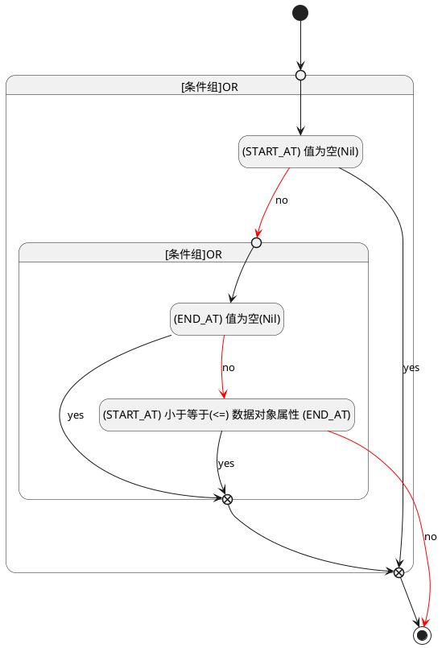

## 开始时间(START_AT) <!-- {docsify-ignore-all} -->

   

### 开始时间 :id=START_AT

#### 条件说明

##### (START_AT) 小于等于(<=) 数据对象属性 (END_AT) :id=a774a7f8b20e9510a32daabe235034038

`START_AT(开始时间)` LTANDEQ  `END_AT`

> [!ATTENTION|label:规则信息|icon:fa fa-warning]
> 开始时间必须小于等于结束时间

##### (END_AT) 值为空(Nil) :id=aa2494aa7aa1e9ca73b88d9edefbf5c13

`END_AT(截止时间)` ISNULL 

##### (START_AT) 值为空(Nil) :id=a66a94df72887fc732017c446f897dd01

`START_AT(开始时间)` ISNULL 

