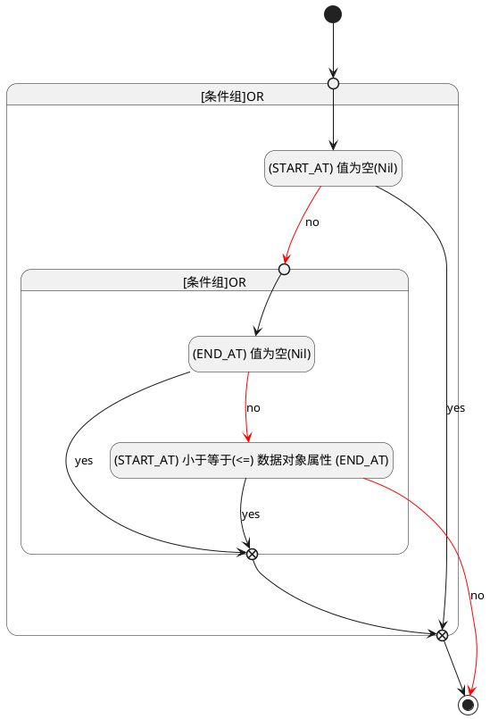

## 开始时间(START_AT) <!-- {docsify-ignore-all} -->

   

### 开始时间 :id=START_AT

#### 条件说明

##### (START_AT) 值为空(Nil) :id=aea1b4e925ec8ca7c65b9ea2c017e7aa1

`START_AT(开始时间)` ISNULL 

##### (END_AT) 值为空(Nil) :id=a60a7dad18316526d2143d50ebc392251

`END_AT(截止时间)` ISNULL 

##### (START_AT) 小于等于(<=) 数据对象属性 (END_AT) :id=a4160172e2f8324590e47d8be82095319

`START_AT(开始时间)` LTANDEQ  `END_AT`

> [!ATTENTION|label:规则信息|icon:fa fa-warning]
> 开始时间必须小于等于结束时间

