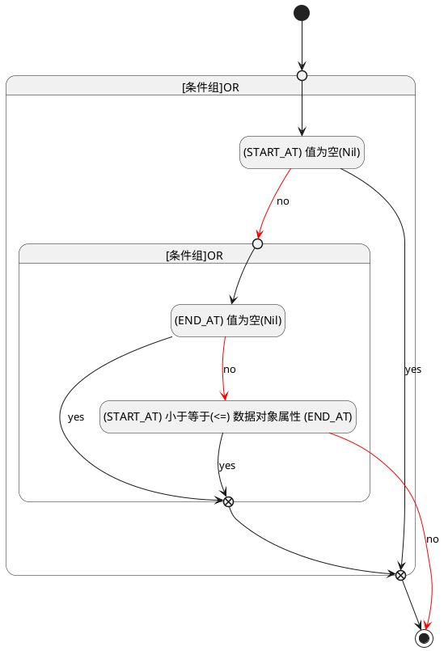

## 开始时间(START_AT) <!-- {docsify-ignore-all} -->

   

### 开始时间 :id=START_AT

#### 条件说明

##### (END_AT) 值为空(Nil) :id=ada34cd104d6fb3329082c8e970f71333

`END_AT(截止时间)` ISNULL 

##### (START_AT) 值为空(Nil) :id=a0b9c859e9849400130046b24d84e4be6

`START_AT(开始时间)` ISNULL 

##### (START_AT) 小于等于(<=) 数据对象属性 (END_AT) :id=a2fe6bf69c3894901654fe064c1f3ecdb

`START_AT(开始时间)` LTANDEQ  `END_AT`

> [!ATTENTION|label:规则信息|icon:fa fa-warning]
> 开始时间必须小于等于结束时间

