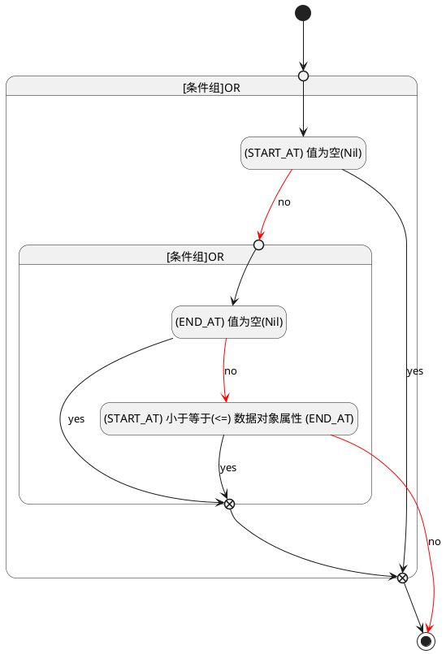

## 开始时间(START_AT) <!-- {docsify-ignore-all} -->

   

### 开始时间 :id=START_AT

#### 条件说明

##### (START_AT) 小于等于(<=) 数据对象属性 (END_AT) :id=ac6ad377c0aa2ede99279cab936d2be55

`START_AT(开始时间)` LTANDEQ  `END_AT`

> [!ATTENTION|label:规则信息|icon:fa fa-warning]
> 开始时间必须小于等于结束时间

##### (END_AT) 值为空(Nil) :id=a56148d0e3e715f91ba89ddd41f8b290b

`END_AT(截止时间)` ISNULL 

##### (START_AT) 值为空(Nil) :id=a9a16606e0bb5eb5b2313d64e8b64b750

`START_AT(开始时间)` ISNULL 

