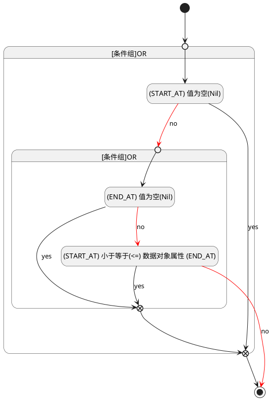

## 开始时间(START_AT) <!-- {docsify-ignore-all} -->

   

### 开始时间 :id=START_AT

```plantuml
@startuml
hide empty description
<style>
root {
  HyperlinkColor #42b983
}
</style>

state "start" as start  <<start>>
state "end" as end <<end>>
state "[条件组]OR" as 5e5300b292c02a7fdd626156dcb30432 [[$./start_at#a5e5300b292c02a7fdd626156dcb30432 {"[条件组]OR"}]] {
state " " as 5e5300b292c02a7fdd626156dcb30432_entry  <<entryPoint>>
state "(START_AT) 值为空(Nil)" as 2913cec647470ad8b4fb73783c572ac5 [[$./start_at#a2913cec647470ad8b4fb73783c572ac5 {"[常规条件] 值为空(Nil)"}]]
state "[条件组]OR" as c1cdf8b39a0374f56aa582db26e67026 [[$./start_at#ac1cdf8b39a0374f56aa582db26e67026 {"[条件组]OR"}]] {
state " " as c1cdf8b39a0374f56aa582db26e67026_entry  <<entryPoint>>
state "(END_AT) 值为空(Nil)" as 7cad86e6e37ec0f16850ac0afc46c931 [[$./start_at#a7cad86e6e37ec0f16850ac0afc46c931 {"[常规条件] 值为空(Nil)"}]]
state "(START_AT) 小于等于(<=) 数据对象属性 (END_AT)" as b4b657bd3b02b723a7b0819e96cf76ee [[$./start_at#ab4b657bd3b02b723a7b0819e96cf76ee {"[常规条件] 小于等于(<=) 数据对象属性 (END_AT)"}]]
state " " as c1cdf8b39a0374f56aa582db26e67026_exit  <<exitPoint>>
}
state " " as 5e5300b292c02a7fdd626156dcb30432_exit  <<exitPoint>>
}


start --> 5e5300b292c02a7fdd626156dcb30432_entry 
5e5300b292c02a7fdd626156dcb30432_entry --> 2913cec647470ad8b4fb73783c572ac5 
2913cec647470ad8b4fb73783c572ac5 --> 5e5300b292c02a7fdd626156dcb30432_exit  : yes
2913cec647470ad8b4fb73783c572ac5 -[#red]-> c1cdf8b39a0374f56aa582db26e67026_entry  : no

c1cdf8b39a0374f56aa582db26e67026_entry --> 7cad86e6e37ec0f16850ac0afc46c931 
7cad86e6e37ec0f16850ac0afc46c931 --> c1cdf8b39a0374f56aa582db26e67026_exit  : yes
7cad86e6e37ec0f16850ac0afc46c931 -[#red]-> b4b657bd3b02b723a7b0819e96cf76ee  : no

b4b657bd3b02b723a7b0819e96cf76ee --> c1cdf8b39a0374f56aa582db26e67026_exit  : yes
b4b657bd3b02b723a7b0819e96cf76ee -[#red]-> end  : no
c1cdf8b39a0374f56aa582db26e67026_exit --> 5e5300b292c02a7fdd626156dcb30432_exit 
5e5300b292c02a7fdd626156dcb30432_exit --> end 


@enduml
```

#### 条件说明

##### (START_AT) 值为空(Nil) :id=a2913cec647470ad8b4fb73783c572ac5

`START_AT(开始时间)` ISNULL 

##### (START_AT) 小于等于(<=) 数据对象属性 (END_AT) :id=ab4b657bd3b02b723a7b0819e96cf76ee

`START_AT(开始时间)` LTANDEQ  `END_AT`

> [!ATTENTION|label:规则信息|icon:fa fa-warning]
> 开始时间必须小于等于结束时间

##### (END_AT) 值为空(Nil) :id=a7cad86e6e37ec0f16850ac0afc46c931

`END_AT(截止时间)` ISNULL 

