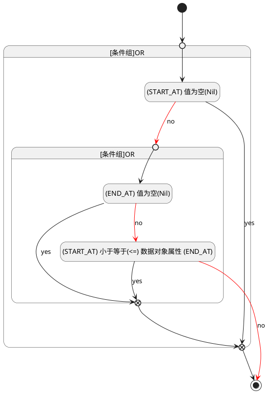

## 开始时间(START_AT) <!-- {docsify-ignore-all} -->

   

### 开始时间 :id=START_AT

```plantuml
@startuml
hide empty description
<style>
root {
  HyperlinkColor #42b983
}
</style>

state "start" as start  <<start>>
state "end" as end <<end>>
state "[条件组]OR" as c6b9556e74e6c78565b9a743e516efdc [[$./start_at#ac6b9556e74e6c78565b9a743e516efdc {"[条件组]OR"}]] {
state " " as c6b9556e74e6c78565b9a743e516efdc_entry  <<entryPoint>>
state "(START_AT) 值为空(Nil)" as f34ccd92399d05a5f1aff3e4213a6774 [[$./start_at#af34ccd92399d05a5f1aff3e4213a6774 {"[常规条件] 值为空(Nil)"}]]
state "[条件组]OR" as 51f91dab7d95f9b2d026ac101e1ed28c [[$./start_at#a51f91dab7d95f9b2d026ac101e1ed28c {"[条件组]OR"}]] {
state " " as 51f91dab7d95f9b2d026ac101e1ed28c_entry  <<entryPoint>>
state "(END_AT) 值为空(Nil)" as c663cb89221bde4c886c46c56ffc8c7f [[$./start_at#ac663cb89221bde4c886c46c56ffc8c7f {"[常规条件] 值为空(Nil)"}]]
state "(START_AT) 小于等于(<=) 数据对象属性 (END_AT)" as c7c36c293cc0b154074abfe86dd7eac6 [[$./start_at#ac7c36c293cc0b154074abfe86dd7eac6 {"[常规条件] 小于等于(<=) 数据对象属性 (END_AT)"}]]
state " " as 51f91dab7d95f9b2d026ac101e1ed28c_exit  <<exitPoint>>
}
state " " as c6b9556e74e6c78565b9a743e516efdc_exit  <<exitPoint>>
}


start --> c6b9556e74e6c78565b9a743e516efdc_entry 
c6b9556e74e6c78565b9a743e516efdc_entry --> f34ccd92399d05a5f1aff3e4213a6774 
f34ccd92399d05a5f1aff3e4213a6774 --> c6b9556e74e6c78565b9a743e516efdc_exit  : yes
f34ccd92399d05a5f1aff3e4213a6774 -[#red]-> 51f91dab7d95f9b2d026ac101e1ed28c_entry  : no

51f91dab7d95f9b2d026ac101e1ed28c_entry --> c663cb89221bde4c886c46c56ffc8c7f 
c663cb89221bde4c886c46c56ffc8c7f --> 51f91dab7d95f9b2d026ac101e1ed28c_exit  : yes
c663cb89221bde4c886c46c56ffc8c7f -[#red]-> c7c36c293cc0b154074abfe86dd7eac6  : no

c7c36c293cc0b154074abfe86dd7eac6 --> 51f91dab7d95f9b2d026ac101e1ed28c_exit  : yes
c7c36c293cc0b154074abfe86dd7eac6 -[#red]-> end  : no
51f91dab7d95f9b2d026ac101e1ed28c_exit --> c6b9556e74e6c78565b9a743e516efdc_exit 
c6b9556e74e6c78565b9a743e516efdc_exit --> end 


@enduml
```

#### 条件说明

##### (END_AT) 值为空(Nil) :id=ac663cb89221bde4c886c46c56ffc8c7f

`END_AT(截止时间)` ISNULL 

##### (START_AT) 小于等于(<=) 数据对象属性 (END_AT) :id=ac7c36c293cc0b154074abfe86dd7eac6

`START_AT(开始时间)` LTANDEQ  `END_AT`

> [!ATTENTION|label:规则信息|icon:fa fa-warning]
> 开始时间必须小于等于结束时间

##### (START_AT) 值为空(Nil) :id=af34ccd92399d05a5f1aff3e4213a6774

`START_AT(开始时间)` ISNULL 

