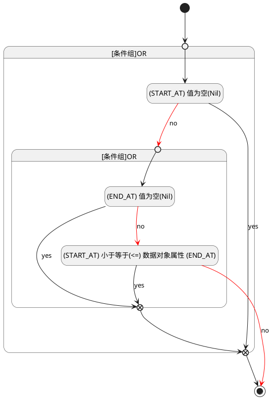

## 开始时间(START_AT) <!-- {docsify-ignore-all} -->

   

### 开始时间 :id=START_AT

```plantuml
@startuml
hide empty description
<style>
root {
  HyperlinkColor #42b983
}
</style>

state "start" as start  <<start>>
state "end" as end <<end>>
state "[条件组]OR" as 3754ee6ea15d469148de1f1e16f5d877 [[$./start_at#a3754ee6ea15d469148de1f1e16f5d877 {"[条件组]OR"}]] {
state " " as 3754ee6ea15d469148de1f1e16f5d877_entry  <<entryPoint>>
state "(START_AT) 值为空(Nil)" as aee31b5b7ed88b88178d93ae21fcce1f [[$./start_at#aaee31b5b7ed88b88178d93ae21fcce1f {"[常规条件] 值为空(Nil)"}]]
state "[条件组]OR" as c2f5fe0add1a794216536ac468a7fcc3 [[$./start_at#ac2f5fe0add1a794216536ac468a7fcc3 {"[条件组]OR"}]] {
state " " as c2f5fe0add1a794216536ac468a7fcc3_entry  <<entryPoint>>
state "(END_AT) 值为空(Nil)" as 6909c90c4e9dd8f40fa6d5092dc78a66 [[$./start_at#a6909c90c4e9dd8f40fa6d5092dc78a66 {"[常规条件] 值为空(Nil)"}]]
state "(START_AT) 小于等于(<=) 数据对象属性 (END_AT)" as 907261b5184760eac60a45c4ed64daee [[$./start_at#a907261b5184760eac60a45c4ed64daee {"[常规条件] 小于等于(<=) 数据对象属性 (END_AT)"}]]
state " " as c2f5fe0add1a794216536ac468a7fcc3_exit  <<exitPoint>>
}
state " " as 3754ee6ea15d469148de1f1e16f5d877_exit  <<exitPoint>>
}


start --> 3754ee6ea15d469148de1f1e16f5d877_entry 
3754ee6ea15d469148de1f1e16f5d877_entry --> aee31b5b7ed88b88178d93ae21fcce1f 
aee31b5b7ed88b88178d93ae21fcce1f --> 3754ee6ea15d469148de1f1e16f5d877_exit  : yes
aee31b5b7ed88b88178d93ae21fcce1f -[#red]-> c2f5fe0add1a794216536ac468a7fcc3_entry  : no

c2f5fe0add1a794216536ac468a7fcc3_entry --> 6909c90c4e9dd8f40fa6d5092dc78a66 
6909c90c4e9dd8f40fa6d5092dc78a66 --> c2f5fe0add1a794216536ac468a7fcc3_exit  : yes
6909c90c4e9dd8f40fa6d5092dc78a66 -[#red]-> 907261b5184760eac60a45c4ed64daee  : no

907261b5184760eac60a45c4ed64daee --> c2f5fe0add1a794216536ac468a7fcc3_exit  : yes
907261b5184760eac60a45c4ed64daee -[#red]-> end  : no
c2f5fe0add1a794216536ac468a7fcc3_exit --> 3754ee6ea15d469148de1f1e16f5d877_exit 
3754ee6ea15d469148de1f1e16f5d877_exit --> end 


@enduml
```

#### 条件说明

##### (START_AT) 小于等于(<=) 数据对象属性 (END_AT) :id=a907261b5184760eac60a45c4ed64daee

`START_AT(开始时间)` LTANDEQ  `END_AT`

> [!ATTENTION|label:规则信息|icon:fa fa-warning]
> 开始时间必须小于等于结束时间

##### (END_AT) 值为空(Nil) :id=a6909c90c4e9dd8f40fa6d5092dc78a66

`END_AT(截止时间)` ISNULL 

##### (START_AT) 值为空(Nil) :id=aaee31b5b7ed88b88178d93ae21fcce1f

`START_AT(开始时间)` ISNULL 

