## 判断操作列是否禁用 <!-- {docsify-ignore-all} -->

   用于动态控制激活行为的禁用状态

### 处理过程

```plantuml
@startuml
hide footbox
<style>
root {
  HyperlinkColor #42b983
}
</style>

hide empty description
state "开始" as Begin <<start>> [[$./judge_column_state#begin {开始}]]
state "结束" as END1 <<end>> [[$./judge_column_state#end1 {结束}]]
state "判断操作列是否禁用" as RAWJSCODE1  [[$./judge_column_state#rawjscode1 {判断操作列是否禁用}]]


Begin --> RAWJSCODE1
RAWJSCODE1 --> END1


@enduml
```




### 处理步骤说明

#### 开始 :id=Begin<sup class="footnote-symbol"> <font color=gray size=1>[开始]</font></sup>


#### 判断操作列是否禁用 :id=RAWJSCODE1<sup class="footnote-symbol"> <font color=gray size=1>[直接前台代码]</font></sup>


<p class="panel-title"><b>执行代码</b></p>

```javascript
	const rows = uiLogic.grid.state.rows;
    console.log(rows);
	if (rows && rows.length > 0) {
		rows.forEach(row => {
			const is_system = row.data.is_system;
					 if (is_system === 1) {
						// 禁用
                        row.uaColStates.uagridcolumn1.visible = false;
                        Object.values(row.uaColStates.uagridcolumn1).forEach(item => {
                            item.visible = false;
                            item.disabled = true;
                        })
					} 	
		})
	}

```

#### 结束 :id=END1<sup class="footnote-symbol"> <font color=gray size=1>[结束]</font></sup>


### 实体逻辑参数

|    中文名   |    代码名    |  数据类型      |备注 |
| --------| --------| --------  | --------   |
|表格|Grid|当前部件对象||
|传入变量(<i class="fa fa-check"/></i>)|Default|数据对象||
