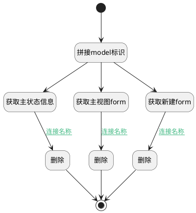

## 删除扩展模型 <!-- {docsify-ignore-all} -->

   删除工作项类型绑定的扩展模型

### 处理过程




### 处理步骤说明

#### 开始 :id=Begin<sup class="footnote-symbol"> <font color=gray size=1>[开始]</font></sup>


*- N/A*
#### 拼接model标识 :id=RAWSFCODE_01<sup class="footnote-symbol"> <font color=gray size=1>[直接后台代码]</font></sup>


<p class="panel-title"><b>执行代码[Groovy]</b></p>

```groovy
def _default = logic.param('default').getReal()
def _new_deform = logic.param('new_deform').getReal()
def _main_deform = logic.param('main_deform').getReal()
def _default_ms_logic = logic.param('default_ms_logic').getReal()

_new_deform.id="ProjMgmt.work_item."+_default.id
_main_deform.id="ProjMgmt.work_item.new_"+_default.id
_default_ms_logic.id="ProjMgmt.work_item."+_default.id

```

#### 获取主状态信息 :id=DEACTION_05<sup class="footnote-symbol"> <font color=gray size=1>[实体行为]</font></sup>


调用实体 [实体主状态迁移逻辑(PSDEMSLOGIC)](module/extension/PSDEMSLogic.md) 行为 [Get](module/extension/PSDEMSLogic#行为) ，行为参数为`default_ms_logic`

将执行结果返回给参数`default_ms_logic`

#### 获取主视图form :id=DEACTION_03<sup class="footnote-symbol"> <font color=gray size=1>[实体行为]</font></sup>


调用实体 [实体表单(PSDEFORM)](module/extension/PSDEForm.md) 行为 [Get](module/extension/PSDEForm#行为) ，行为参数为`main_deform`

将执行结果返回给参数`main_deform`

#### 获取新建form :id=DEACTION_01<sup class="footnote-symbol"> <font color=gray size=1>[实体行为]</font></sup>


调用实体 [实体表单(PSDEFORM)](module/extension/PSDEForm.md) 行为 [Get](module/extension/PSDEForm#行为) ，行为参数为`new_deform`

将执行结果返回给参数`new_deform`

#### 删除 :id=DEACTION_06<sup class="footnote-symbol"> <font color=gray size=1>[实体行为]</font></sup>


调用实体 [实体主状态迁移逻辑(PSDEMSLOGIC)](module/extension/PSDEMSLogic.md) 行为 [Remove](module/extension/PSDEMSLogic#行为) ，行为参数为`default_ms_logic`

#### 删除 :id=DEACTION_02<sup class="footnote-symbol"> <font color=gray size=1>[实体行为]</font></sup>


调用实体 [实体表单(PSDEFORM)](module/extension/PSDEForm.md) 行为 [Remove](module/extension/PSDEForm#行为) ，行为参数为`new_deform`

#### 删除 :id=DEACTION_04<sup class="footnote-symbol"> <font color=gray size=1>[实体行为]</font></sup>


调用实体 [实体表单(PSDEFORM)](module/extension/PSDEForm.md) 行为 [Remove](module/extension/PSDEForm#行为) ，行为参数为`main_deform`

#### 结束 :id=END_01<sup class="footnote-symbol"> <font color=gray size=1>[结束]</font></sup>


*- N/A*


### 连接条件说明
#### 连接名称 :id=DEACTION_01-DEACTION_02

`new_deform(new_deform).PSDEFORMID(实体表单标识)` ISNOTNULL
#### 连接名称 :id=DEACTION_03-DEACTION_04

`main_deform(main_deform).PSDEFORMID(实体表单标识)` ISNOTNULL
#### 连接名称 :id=DEACTION_05-DEACTION_06

`default_ms_logic(default_ms_logic).PSDELOGICID(实体处理逻辑标识)` ISNOTNULL


### 实体逻辑参数

|    中文名   |    代码名    |  数据类型    |  实体   |备注 |
| --------| --------| -------- | -------- | --------   |
|传入变量(<i class="fa fa-check"/></i>)|Default|数据对象|[工作项类型(WORK_ITEM_TYPE)](module/ProjMgmt/work_item_type.md)||
|default_ms_logic|default_ms_logic|数据对象|[实体主状态迁移逻辑(PSDEMSLOGIC)](module/extension/PSDEMSLogic.md)||
|main_deform|main_deform|数据对象|[实体表单(PSDEFORM)](module/extension/PSDEForm.md)||
|new_deform|new_deform|数据对象|[实体表单(PSDEFORM)](module/extension/PSDEForm.md)||
