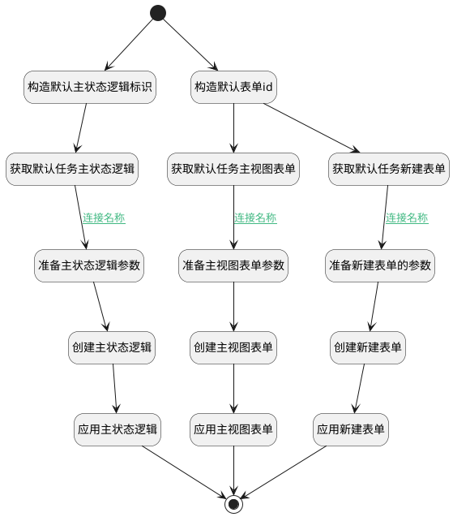

## 准备默认扩展模型 <!-- {docsify-ignore-all} -->

   给新建的工作项类型绑定默认模型

### 处理过程




### 处理步骤说明

#### 开始 :id=Begin<sup class="footnote-symbol"> <font color=gray size=1>[开始]</font></sup>


*- N/A*
#### 构造默认主状态逻辑标识 :id=RAWSFCODE_04<sup class="footnote-symbol"> <font color=gray size=1>[直接后台代码]</font></sup>


<p class="panel-title"><b>执行代码[Groovy]</b></p>

```groovy
def default_ms_logic = logic.param('default_ms_logic').getReal()
def _default =  logic.param('default').getReal()
def project_type=_default.project_type

default_ms_logic.id="ProjMgmt.work_item."+project_type+"_task"
```

#### 构造默认表单id :id=RAWSFCODE_01<sup class="footnote-symbol"> <font color=gray size=1>[直接后台代码]</font></sup>


<p class="panel-title"><b>执行代码[Groovy]</b></p>

```groovy
def _default_create_form = logic.param('default_create_form').getReal()
def _default_main_form = logic.param('default_main_form').getReal()
def _default =  logic.param('default').getReal()
def project_type=_default.project_type

_default_create_form.id="ProjMgmt.work_item.new_"+project_type+"_task"
_default_main_form.id="ProjMgmt.work_item."+project_type+"_task"
```

#### 获取默认任务主视图表单 :id=DEACTION_02<sup class="footnote-symbol"> <font color=gray size=1>[实体行为]</font></sup>


调用实体 [实体表单(PSDEFORM)](module/extension/PSDEForm.md) 行为 [Get](module/extension/PSDEForm#行为) ，行为参数为`default_main_form`

将执行结果返回给参数`default_main_form`

#### 获取默认任务主状态逻辑 :id=DEACTION_07<sup class="footnote-symbol"> <font color=gray size=1>[实体行为]</font></sup>


调用实体 [实体主状态迁移逻辑(PSDEMSLOGIC)](module/extension/PSDEMSLogic.md) 行为 [Get](module/extension/PSDEMSLogic#行为) ，行为参数为`default_ms_logic(默认主状态逻辑)`

将执行结果返回给参数`default_ms_logic(默认主状态逻辑)`

#### 获取默认任务新建表单 :id=DEACTION_01<sup class="footnote-symbol"> <font color=gray size=1>[实体行为]</font></sup>


调用实体 [实体表单(PSDEFORM)](module/extension/PSDEForm.md) 行为 [Get](module/extension/PSDEForm#行为) ，行为参数为`default_create_form`

将执行结果返回给参数`default_create_form`

#### 准备新建表单的参数 :id=RAWSFCODE_03<sup class="footnote-symbol"> <font color=gray size=1>[直接后台代码]</font></sup>


<p class="panel-title"><b>执行代码[Groovy]</b></p>

```groovy
def _default_create_form = logic.param('default_create_form').getReal();
def _default =  logic.param('default').getReal(); 
def code_name=_default.id

_default_create_form.id="ProjMgmt.work_item.new_"+code_name
_default_create_form.psdeid="ProjMgmt.work_item"
_default_create_form.name="新建"+_default.name
_default_create_form.codename="new_"+code_name
_default_create_form.datatype=code_name


```

#### 准备主视图表单参数 :id=RAWSFCODE_02<sup class="footnote-symbol"> <font color=gray size=1>[直接后台代码]</font></sup>


<p class="panel-title"><b>执行代码[Groovy]</b></p>

```groovy
def _default_main_form = logic.param('default_main_form').getReal();
def _default =  logic.param('default').getReal(); 
def code_name=_default.id

_default_main_form.id="ProjMgmt.work_item."+code_name
_default_main_form.psdeid="ProjMgmt.work_item"
_default_main_form.name=_default.name
_default_main_form.codename=code_name
_default_main_form.datatype=code_name
```

#### 准备主状态逻辑参数 :id=RAWSFCODE_05<sup class="footnote-symbol"> <font color=gray size=1>[直接后台代码]</font></sup>


<p class="panel-title"><b>执行代码[Groovy]</b></p>

```groovy
def default_ms_logic = logic.param('default_ms_logic').getReal();
def _default =  logic.param('default').getReal(); 
def code_name=_default.id

default_ms_logic.id="ProjMgmt.work_item."+code_name
default_ms_logic.psdeid="ProjMgmt.work_item"
default_ms_logic.name=_default.name
default_ms_logic.codename=code_name
default_ms_logic.logictag=code_name
```

#### 创建新建表单 :id=DEACTION_03<sup class="footnote-symbol"> <font color=gray size=1>[实体行为]</font></sup>


调用实体 [实体表单(PSDEFORM)](module/extension/PSDEForm.md) 行为 [Create](module/extension/PSDEForm#行为) ，行为参数为`default_create_form`

将执行结果返回给参数`default_create_form`

#### 创建主视图表单 :id=DEACTION_05<sup class="footnote-symbol"> <font color=gray size=1>[实体行为]</font></sup>


调用实体 [实体表单(PSDEFORM)](module/extension/PSDEForm.md) 行为 [Create](module/extension/PSDEForm#行为) ，行为参数为`default_main_form`

将执行结果返回给参数`default_main_form`

#### 创建主状态逻辑 :id=DEACTION_08<sup class="footnote-symbol"> <font color=gray size=1>[实体行为]</font></sup>


调用实体 [实体主状态迁移逻辑(PSDEMSLOGIC)](module/extension/PSDEMSLogic.md) 行为 [Create](module/extension/PSDEMSLogic#行为) ，行为参数为`default_ms_logic(默认主状态逻辑)`

将执行结果返回给参数`default_ms_logic(默认主状态逻辑)`

#### 应用新建表单 :id=DEACTION_04<sup class="footnote-symbol"> <font color=gray size=1>[实体行为]</font></sup>


调用实体 [实体表单(PSDEFORM)](module/extension/PSDEForm.md) 行为 [应用(APPLY)](module/extension/PSDEForm#行为) ，行为参数为`default_create_form`

#### 应用主视图表单 :id=DEACTION_06<sup class="footnote-symbol"> <font color=gray size=1>[实体行为]</font></sup>


调用实体 [实体表单(PSDEFORM)](module/extension/PSDEForm.md) 行为 [应用(APPLY)](module/extension/PSDEForm#行为) ，行为参数为`default_main_form`

#### 应用主状态逻辑 :id=DEACTION_09<sup class="footnote-symbol"> <font color=gray size=1>[实体行为]</font></sup>


调用实体 [实体主状态迁移逻辑(PSDEMSLOGIC)](module/extension/PSDEMSLogic.md) 行为 [应用(APPLY)](module/extension/PSDEMSLogic#行为) ，行为参数为`default_ms_logic(默认主状态逻辑)`

#### 结束 :id=END_01<sup class="footnote-symbol"> <font color=gray size=1>[结束]</font></sup>


返回 `Default(传入变量)`


### 连接条件说明
#### 连接名称 :id=DEACTION_01-RAWSFCODE_03

`default_create_form(default_create_form).PSDEFORMID(实体表单标识)` ISNOTNULL
#### 连接名称 :id=DEACTION_02-RAWSFCODE_02

`default_main_form(default_main_form).PSDEFORMID(实体表单标识)` ISNOTNULL
#### 连接名称 :id=DEACTION_07-RAWSFCODE_05

`default_ms_logic(默认主状态逻辑).PSDELOGICID(实体处理逻辑标识)` ISNOTNULL


### 实体逻辑参数

|    中文名   |    代码名    |  数据类型    |  实体   |备注 |
| --------| --------| -------- | -------- | --------   |
|传入变量(<i class="fa fa-check"/></i>)|Default|数据对象|[工作项类型(WORK_ITEM_TYPE)](module/ProjMgmt/work_item_type.md)||
|default_create_form|default_create_form|数据对象|[实体表单(PSDEFORM)](module/extension/PSDEForm.md)||
|default_main_form|default_main_form|数据对象|[实体表单(PSDEFORM)](module/extension/PSDEForm.md)||
|默认主状态逻辑|default_ms_logic|数据对象|[实体主状态迁移逻辑(PSDEMSLOGIC)](module/extension/PSDEMSLogic.md)||
