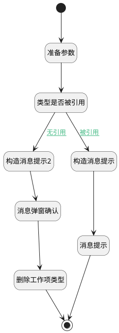

## 删除扩展模型 <!-- {docsify-ignore-all} -->

   

### 处理过程




### 处理步骤说明

#### 开始 :id=Begin<sup class="footnote-symbol"> <font color=gray size=1>[开始]</font></sup>


#### 消息提示 :id=MSGBOX_01<sup class="footnote-symbol"> <font color=gray size=1>[消息弹窗]</font></sup>


#### 构造消息提示 :id=RAWJSCODE_01<sup class="footnote-symbol"> <font color=gray size=1>[直接前台代码]</font></sup>


<p class="panel-title"><b>执行代码</b></p>

```javascript
console.log("构造消息提示");
const _message = uiLogic.message_obj;
const work_item_type_name=uiLogic.default.name;
//去重
const project_names = [...new Set(uiLogic.item_page?.map(p => p.project_name).filter(Boolean))].join(',') || '';
const message = `工作项类型 ${work_item_type_name} 已被项目使用,不能删除！
使用的项目包括: ${project_names} `;

_message.message = message;
_message.title = "提示";
```

#### 准备参数 :id=PREPAREJSPARAM_01<sup class="footnote-symbol"> <font color=gray size=1>[准备参数]</font></sup>


1. 将`Default(传入变量).id` 设置给  `item_filter.n_work_item_type_id_eq`

#### 类型是否被引用 :id=DEDATASET_01<sup class="footnote-symbol"> <font color=gray size=1>[实体数据集]</font></sup>

查询类型是否被工作项引用（包含被删除、归档的工作项）


#### 消息弹窗确认 :id=MSGBOX_02<sup class="footnote-symbol"> <font color=gray size=1>[消息弹窗]</font></sup>


#### 构造消息提示2 :id=RAWJSCODE_02<sup class="footnote-symbol"> <font color=gray size=1>[直接前台代码]</font></sup>


<p class="panel-title"><b>执行代码</b></p>

```javascript
console.log("构造消息提示2");
const _message = uiLogic.message_obj;
const work_item_type_name=uiLogic.default.name;

const message = `确认删除 工作项类型  ${work_item_type_name}  吗？`;

_message.message = message;
_message.title = "确认删除";
```

#### 删除工作项类型 :id=DEACTION_01<sup class="footnote-symbol"> <font color=gray size=1>[实体行为]</font></sup>


调用实体 [工作项类型(WORK_ITEM_TYPE)](module/ProjMgmt/work_item_type.md) 行为 [Remove](module/ProjMgmt/work_item_type#行为) ，行为参数为`Default(传入变量)`

#### 结束 :id=END_01<sup class="footnote-symbol"> <font color=gray size=1>[结束]</font></sup>


### 连接条件说明
#### 被引用 :id=DEDATASET_01-RAWJSCODE_01

```item_page(item_page).length``` GT ```0```
#### 无引用 :id=DEDATASET_01-RAWJSCODE_02

```item_page(item_page).length``` EQ ```0```


### 实体逻辑参数

|    中文名   |    代码名    |  数据类型      |备注 |
| --------| --------| --------  | --------   |
|item_page|item_page|分页查询||
|massage_result|massage_result|上一次调用返回||
|message_obj|message_obj|数据对象||
|传入变量(<i class="fa fa-check"/></i>)|Default|数据对象||
|item_filter|item_filter|过滤器||
