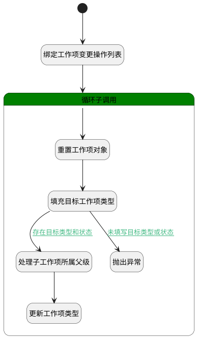

## 变更工作项类型 <!-- {docsify-ignore-all} -->

   变更工作项类型

### 处理过程




### 处理步骤说明

#### 开始 :id=Begin<sup class="footnote-symbol"> <font color=gray size=1>[开始]</font></sup>


*- N/A*
#### 抛出异常 :id=THROWEXCEPTION1<sup class="footnote-symbol"> <font color=gray size=1>[抛出异常]</font></sup>


> [!ATTENTION|label:抛出异常|icon:fa fa-warning]
> 错误信息：未填写目标类型或状态

#### 绑定工作项变更操作列表 :id=BINDPARAM1<sup class="footnote-symbol"> <font color=gray size=1>[绑定参数]</font></sup>


绑定参数`Default(传入变量)` 到 `details(变更明细)`
#### 处理子工作项所属父级 :id=RAWSFCODE1<sup class="footnote-symbol"> <font color=gray size=1>[直接后台代码]</font></sup>


<p class="panel-title"><b>执行代码[Groovy]</b></p>

```groovy
def for_temp = logic.param('for_temp').getReal()
def child_work_item_types = for_temp.get('child_work_item_types')
//获取实体运行对象 参数实体名
def work_item_runtime = sys.dataentity('work_item')

child_work_item_types.each { it ->
    def target_parent = it.get('target_parent')
    if(it.get('influence_child_ids') != null){
        def work_item_filter = work_item_runtime.filter()
        work_item_filter.in('id', it.get('influence_child_ids'))
        def childs = work_item_filter.select('')
        childs.each { item ->
            def update_entity = work_item_runtime.entity()
            update_entity.set('id', item.get('id'))
            if (target_parent != null) {
               update_entity.set('pid', target_parent) 
            } else {
               update_entity.set('pid', null)
            }
            //更新子工作项的所属父级
            work_item_runtime.update(update_entity)
        }       
    }   
}
```

#### 更新工作项类型 :id=DEACTION1<sup class="footnote-symbol"> <font color=gray size=1>[实体行为]</font></sup>


调用实体 [工作项(WORK_ITEM)](module/ProjMgmt/work_item.md) 行为 [Update](module/ProjMgmt/work_item#行为) ，行为参数为`work_item(工作项)`

#### 循环子调用 :id=LOOPSUBCALL1<sup class="footnote-symbol"> <font color=gray size=1>[循环子调用]</font></sup>


循环参数`details(变更明细)`，子循环参数使用`for_temp(循环临时变量)`
#### 重置工作项对象 :id=RESETPARAM1<sup class="footnote-symbol"> <font color=gray size=1>[重置参数]</font></sup>


重置参数```work_item(工作项)```
#### 填充目标工作项类型 :id=PREPAREPARAM1<sup class="footnote-symbol"> <font color=gray size=1>[准备参数]</font></sup>


1. 将`for_temp(循环临时变量).ID(标识)` 设置给  `work_item(工作项).ID(标识)`
2. 将`空值（NULL）` 设置给  `work_item(工作项).PID(父标识)`
3. 将`for_temp(循环临时变量).TARGET_TYPE(目标类型)` 设置给  `work_item(工作项).WORK_ITEM_TYPE_ID(工作项类型)`
4. 将`for_temp(循环临时变量).TARGET_STATE(目标工作项状态)` 设置给  `work_item(工作项).STATE(状态)`


### 连接条件说明
#### 存在目标类型和状态 :id=PREPAREPARAM1-RAWSFCODE1

`for_temp(循环临时变量).TARGET_STATE(目标工作项状态)` ISNOTNULL AND `for_temp(循环临时变量).TARGET_TYPE(目标类型)` ISNOTNULL
#### 未填写目标类型或状态 :id=PREPAREPARAM1-THROWEXCEPTION1

(`for_temp(循环临时变量).TARGET_TYPE(目标类型)` ISNULL OR `for_temp(循环临时变量).TARGET_STATE(目标工作项状态)` ISNULL)


### 实体逻辑参数

|    中文名   |    代码名    |  数据类型    |  实体   |备注 |
| --------| --------| -------- | -------- | --------   |
|传入变量(<i class="fa fa-check"/></i>)|Default|数据对象|[工作项操作向导(WORK_ITEM_WIZARD)](module/ProjMgmt/work_item_wizard.md)||
|子工作项类型列表|child_work_item_types|数据对象列表|[工作项(WORK_ITEM)](module/ProjMgmt/work_item.md)||
|变更明细|details|数据对象列表|[工作项操作向导明细(WORK_ITEM_WIZARD_DETAIL)](module/ProjMgmt/work_item_wizard_detail.md)||
|循环临时变量|for_temp|数据对象|[工作项操作向导明细(WORK_ITEM_WIZARD_DETAIL)](module/ProjMgmt/work_item_wizard_detail.md)||
|工作项|work_item|数据对象|[工作项(WORK_ITEM)](module/ProjMgmt/work_item.md)||
