## CreateTemp后附加 <!-- {docsify-ignore-all} -->

   填充操作明细属性

### 处理过程

```plantuml
@startuml
hide empty description
<style>
root {
  HyperlinkColor #42b983
}
</style>

hide empty description
state "开始" as Begin <<start>> [[$./create_temp_after#begin {"开始"}]]
state "封装details属性" as DEACTION1  [[$./create_temp_after#deaction1 {"封装details属性"}]]
state "结束" as END1 <<end>> [[$./create_temp_after#end1 {"结束"}]]


Begin --> DEACTION1
DEACTION1 --> END1


@enduml
```

### 处理步骤说明

#### 开始 :id=Begin [开始]

*- N/A*
#### 封装details属性 :id=DEACTION1 [实体行为]

调用实体 [工作项操作向导(WORK_ITEM_WIZARD)](module/ProjMgmt/work_item_wizard.md) 行为 [填充属性(fill_details)](module/ProjMgmt/work_item_wizard#行为) ，行为参数为`Default(传入变量)`

将执行结果返回给参数`Default(传入变量)`

#### 结束 :id=END1 [结束]

返回 `Default(传入变量)`

### 实体逻辑参数

|    中文名   |    代码名    |  数据类型    |  实体   |备注 |
| --------| --------| -------- | -------- | --------   |
|传入变量(<i class="fa fa-check"/></i>)|Default|数据对象|[工作项操作向导(WORK_ITEM_WIZARD)](module/ProjMgmt/work_item_wizard.md)||
