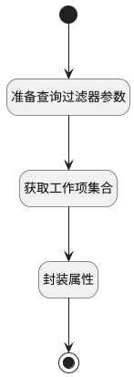

## 填充操作明细属性 <!-- {docsify-ignore-all} -->

   变更工作项类型前，填充操作明细属性

### 处理过程




### 处理步骤说明

#### 开始 :id=Begin<sup class="footnote-symbol"> <font color=gray size=1>[开始]</font></sup>


*- N/A*
#### 准备查询过滤器参数 :id=PREPAREPARAM1<sup class="footnote-symbol"> <font color=gray size=1>[准备参数]</font></sup>


1. 将`Default(传入变量).work_item` 设置给  `work_item_filter(工作项查询过滤器).n_id_in`

#### 获取工作项集合 :id=DEDATASET1<sup class="footnote-symbol"> <font color=gray size=1>[实体数据集]</font></sup>


调用实体 [工作项(WORK_ITEM)](module/ProjMgmt/work_item.md) 数据集合 [数据集(DEFAULT)](module/ProjMgmt/work_item#数据集合) ，查询参数为`work_item_filter(工作项查询过滤器)`

将执行结果返回给参数`work_items(分页查询结果变量)`

#### 封装属性 :id=RAWSFCODE1<sup class="footnote-symbol"> <font color=gray size=1>[直接后台代码]</font></sup>


<p class="panel-title"><b>执行代码[Groovy]</b></p>

```groovy
def _default = logic.param('default').getReal()
def project_id = _default.get('project_id')
def project_runtime = sys.dataentity('project')
def entity_runtime = sys.dataentity('work_item_wizard_detail')
def work_item_runtime = sys.dataentity('work_item')
def work_item_type_runtime = sys.dataentity('work_item_type')
def project = project_runtime.get(project_id);
def details = entity_runtime.list()
def work_items = logic.param('work_items').getReal()
def influence_ids = ''

work_items.each { item ->
    if(influence_ids != ''){
        influence_ids = influence_ids + ',' + item.get('id')
    } else {
        influence_ids = item.get('id')
    }
    def work_item_wizard_detail = sys.entity('work_item_wizard_detail')
    work_item_wizard_detail.set('origin_type', item.get('work_item_type_id'))
    def work_item_type_filter = work_item_type_runtime.filter()
    work_item_type_filter.eq('project_type', project.get('type'))
    work_item_type_filter.ne('id', item.get('work_item_type_id'))
    def choose_types = work_item_type_filter.select('')
    if(choose_types.size() > 0){
        work_item_wizard_detail.set('target_type', choose_types.get(0).get('id'))
    }
    work_item_wizard_detail.set('id', item.get('id'))
    work_item_wizard_detail.set('wizard_id', _default.get('id'))
    work_item_wizard_detail.set('origin_state', item.get('state'))
    work_item_wizard_detail.set('target_state', '10')
    work_item_wizard_detail.set('project_id', item.get('project_id'))
    work_item_wizard_detail.set('title', item.get('title'))
    work_item_wizard_detail.set('assignee_name', item.get('assignee_name'))
    work_item_wizard_detail.set('priority', item.get('priority'))
    work_item_wizard_detail.set('influence', 1)
    // 子工作项
    def child_filter = sys.filter('work_item')
    child_filter.eq('pid', item.get('id'))
    def childs = child_filter.select('')
    work_item_wizard_detail.set('influence_childs', 0)
    if(childs.size() > 0){
        work_item_wizard_detail.set('influence_childs', childs.size())
        def child_work_item_types = work_item_runtime.list()
        def childItems = childs.groupBy { it.get('work_item_type_id') }
        childItems.each { work_item_type_id, itemList ->
            def child_work_item = sys.entity('work_item')
            def influence_child_ids = ''
            child_work_item.set('child_work_item_type', work_item_type_id)
            itemList.each { it ->
                if(influence_child_ids != ''){
                    influence_child_ids = influence_child_ids + ',' + it.get('id')
                } else {
                    influence_child_ids = it.get('id')
                }
            }
            child_work_item.set('influence_child_ids', influence_child_ids)
            child_work_item.set('parent_title', work_item_wizard_detail.get('title'))
            child_work_item.set('influence', itemList.size())
            child_work_item.set('id', work_item_type_id)
            child_work_item.set('parent_origin_type', item.get('work_item_type_id'))
            child_work_item_types.add(child_work_item)
        }
        work_item_wizard_detail.set('child_work_item_types', child_work_item_types)
    }
    details.add(work_item_wizard_detail)
}
_default.set('details', details)
_default.set('influence_ids', influence_ids)
```

#### 结束 :id=END1<sup class="footnote-symbol"> <font color=gray size=1>[结束]</font></sup>


返回 `Default(传入变量)`


### 实体逻辑参数

|    中文名   |    代码名    |  数据类型    |  实体   |备注 |
| --------| --------| -------- | -------- | --------   |
|传入变量(<i class="fa fa-check"/></i>)|Default|数据对象|[工作项操作向导(WORK_ITEM_WIZARD)](module/ProjMgmt/work_item_wizard.md)||
|工作项|work_item|数据对象|[工作项(WORK_ITEM)](module/ProjMgmt/work_item.md)||
|工作项查询过滤器|work_item_filter|过滤器|||
|分页查询结果变量|work_items|分页查询|||
