## 创建临时数据 <!-- {docsify-ignore-all} -->

   

### 处理过程

```plantuml
@startuml
hide footbox
<style>
root {
  HyperlinkColor #42b983
}
</style>

hide empty description
state "开始" as Begin <<start>> [[$./create_temp_data#begin {开始}]]
state "添加临时数据details" as RAWJSCODE1  [[$./create_temp_data#rawjscode1 {添加临时数据details}]]
state "准备参数" as PREPAREJSPARAM1  [[$./create_temp_data#preparejsparam1 {准备参数}]]
state "填充details属性" as DEACTION1  [[$./create_temp_data#deaction1 {填充details属性}]]


Begin --> PREPAREJSPARAM1
PREPAREJSPARAM1 --> DEACTION1
DEACTION1 --> RAWJSCODE1


@enduml
```




### 处理步骤说明

#### 开始 :id=Begin<sup class="footnote-symbol"> <font color=gray size=1>[开始]</font></sup>


#### 准备参数 :id=PREPAREJSPARAM1<sup class="footnote-symbol"> <font color=gray size=1>[准备参数]</font></sup>


1. 将`ctx(应用上下文变量).work_item` 设置给  `Default(传入变量).work_item`
2. 将`ctx(应用上下文变量).project` 设置给  `Default(传入变量).project_id`

#### 填充details属性 :id=DEACTION1<sup class="footnote-symbol"> <font color=gray size=1>[实体行为]</font></sup>


调用实体 [工作项操作向导(WORK_ITEM_WIZARD)](module/ProjMgmt/work_item_wizard.md) 行为 [填充属性(fill_details)](module/ProjMgmt/work_item_wizard#行为) ，行为参数为`Default(传入变量)`

将执行结果返回给参数`Default(传入变量)`

#### 添加临时数据details :id=RAWJSCODE1<sup class="footnote-symbol"> <font color=gray size=1>[直接前台代码]</font></sup>


<p class="panel-title"><b>执行代码</b></p>

```javascript
var details = uiLogic.default.details;
for (var i = 0; i < details.length; i++) {
    ibiz.hub.getApp(context.srfappid).deService.exec(
        'plmweb.work_item_wizard_detail',
        'Create',
        context,
        uiLogic.default.details[i],
    );
}


```


### 实体逻辑参数

|    中文名   |    代码名    |  数据类型      |备注 |
| --------| --------| --------  | --------   |
|传入变量(<i class="fa fa-check"/></i>)|Default|数据对象||
|当前视图对象|view|当前视图对象||
|应用上下文变量|ctx|导航视图参数绑定参数||
|ctrl|ctrl|当前部件对象||
