## 删除评论 <!-- {docsify-ignore-all} -->

   删除评论

### 处理过程

```plantuml
@startuml
hide empty description
<style>
root {
  HyperlinkColor #42b983
}
</style>

hide empty description
state "开始" as Begin <<start>> [[$./del_comment#begin {"开始"}]]
state "填充评论属性" as PREPAREPARAM1  [[$./del_comment#prepareparam1 {"填充评论属性"}]]
state "删除评论" as DEACTION1  [[$./del_comment#deaction1 {"删除评论"}]]
state "热度-2" as RAWSQLCALL1  [[$./del_comment#rawsqlcall1 {"热度-2"}]]
state "结束" as END1 <<end>> [[$./del_comment#end1 {"结束"}]]


Begin --> PREPAREPARAM1
PREPAREPARAM1 --> DEACTION1
DEACTION1 --> RAWSQLCALL1
RAWSQLCALL1 --> END1


@enduml
```




### 处理步骤说明

#### 开始 :id=Begin<sup class="footnote-symbol"> <font color=gray size=1>[开始]</font></sup>


*- N/A*
#### 填充评论属性 :id=PREPAREPARAM1<sup class="footnote-symbol"> <font color=gray size=1>[准备参数]</font></sup>


1. 将`Default(传入变量).comment_id` 设置给  `comment(评论对象).ID(标识)`

#### 删除评论 :id=DEACTION1<sup class="footnote-symbol"> <font color=gray size=1>[实体行为]</font></sup>


调用实体 [评论(COMMENT)](module/Base/comment.md) 行为 [Remove](module/Base/comment#行为) ，行为参数为`comment(评论对象)`

将执行结果返回给参数`comment(评论对象)`

#### 热度-2 :id=RAWSQLCALL1<sup class="footnote-symbol"> <font color=gray size=1>[直接SQL调用]</font></sup>


<p class="panel-title"><b>执行sql语句</b></p>

```sql
update discuss_post t1 set t1.heat = t1.heat - 2 
where exists(select 1 from `comment` t2 
where t2.principal_id = t1.id 
and t2.principal_type = 'DISCUSS_POST' and t2.id = ?)
```

<p class="panel-title"><b>执行sql参数</b></p>

1. `Default(传入变量).comment_id`


#### 结束 :id=END1<sup class="footnote-symbol"> <font color=gray size=1>[结束]</font></sup>


返回 `Default(传入变量)`


### 实体逻辑参数

|    中文名   |    代码名    |  数据类型    |  实体   |备注 |
| --------| --------| -------- | -------- | --------   |
|传入变量(<i class="fa fa-check"/></i>)|Default|数据对象|[讨论(DISCUSS_POST)](module/Team/discuss_post.md)||
|评论对象|comment|数据对象|[评论(COMMENT)](module/Base/comment.md)||
