## 获取讨论权限 <!-- {docsify-ignore-all} -->

   获取讨论权限，创建人等于自己，则srfreadonly为false。否则直接结束，不返回数据

### 处理过程

```plantuml
@startuml
hide empty description
<style>
root {
  HyperlinkColor #42b983
}
</style>

hide empty description
state "开始" as Begin <<start>> [[$./get_post_auth#begin {"开始"}]]
state "结束" as END1 <<end>> [[$./get_post_auth#end1 {"结束"}]]
state "调试逻辑参数" as DEBUGPARAM1  [[$./get_post_auth#debugparam1 {"调试逻辑参数"}]]
state "判断" as RAWSFCODE1  [[$./get_post_auth#rawsfcode1 {"判断"}]]


Begin --> DEBUGPARAM1
DEBUGPARAM1 --> RAWSFCODE1
RAWSFCODE1 --> END1


@enduml
```




### 处理步骤说明

#### 开始 :id=Begin<sup class="footnote-symbol"> <font color=gray size=1>[开始]</font></sup>


*- N/A*
#### 结束 :id=END1<sup class="footnote-symbol"> <font color=gray size=1>[结束]</font></sup>


返回 `Default(传入变量)`

#### 调试逻辑参数 :id=DEBUGPARAM1<sup class="footnote-symbol"> <font color=gray size=1>[调试逻辑参数]</font></sup>


> [!NOTE|label:调试信息|icon:fa fa-bug]
> 调试输出参数`Default(传入变量)`的详细信息


#### 判断 :id=RAWSFCODE1<sup class="footnote-symbol"> <font color=gray size=1>[直接后台代码]</font></sup>


<p class="panel-title"><b>执行代码[Groovy]</b></p>

```groovy
def _default = logic.param('default').real;
def userid = sys.user().getUserid();
if (userid == _default.get('create_man')) {
    _default.set('srfreadonly', false);
}

```


### 实体逻辑参数

|    中文名   |    代码名    |  数据类型    |  实体   |备注 |
| --------| --------| -------- | -------- | --------   |
|传入变量(<i class="fa fa-check"/></i>)|Default|数据对象|[讨论(DISCUSS_POST)](module/Team/discuss_post.md)||
