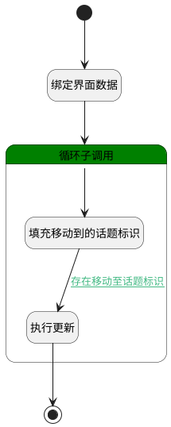

## 移动 <!-- {docsify-ignore-all} -->

   移动讨论至话题

### 处理过程

### 处理步骤说明

#### 开始 :id=Begin [开始]

*- N/A*
#### 绑定界面数据 :id=BINDPARAM1 [绑定参数]

绑定参数`Default(传入变量)` 到 `srfactionparam(选中数据列表对象)`
#### 结束 :id=END1 [结束]

返回 `update_obj(更新对象)`

#### 循环子调用 :id=LOOPSUBCALL1 [循环子调用]

循环参数`srfactionparam(选中数据列表对象)`，子循环参数使用`for_temp_obj(循环临时变量)`
#### 填充移动到的话题标识 :id=PREPAREPARAM1 [准备参数]

1. 将`for_temp_obj(循环临时变量).target_topic_id` 设置给  `update_obj(更新对象).TOPIC_ID(话题标识)`
2. 将` ==> update_obj[IDENTIFIER]` 设置给  `update_obj(更新对象).IDENTIFIER(编号)`
3. 将`Default(传入变量).ID(标识)` 设置给  `update_obj(更新对象).ID(标识)`

#### 执行更新 :id=DEACTION1 [实体行为]

调用实体 [讨论(DISCUSS_POST)](module/Team/discuss_post.md) 行为 [Update](module/Team/discuss_post#行为) ，行为参数为`update_obj(更新对象)`

### 连接条件说明
#### 存在移动至话题标识 :id=PREPAREPARAM1-DEACTION1

`update_obj(更新对象).TOPIC_ID(话题标识)` ISNOTNULL

### 实体逻辑参数

|    中文名   |    代码名    |  数据类型    |  实体   |备注 |
| --------| --------| -------- | -------- | --------   |
|传入变量(<i class="fa fa-check"/></i>)|Default|数据对象|[讨论(DISCUSS_POST)](module/Team/discuss_post.md)||
|循环临时变量|for_temp_obj|数据对象|[讨论(DISCUSS_POST)](module/Team/discuss_post.md)||
|选中数据列表对象|srfactionparam|数据对象列表|[讨论(DISCUSS_POST)](module/Team/discuss_post.md)||
|更新对象|update_obj|数据对象|[讨论(DISCUSS_POST)](module/Team/discuss_post.md)||
