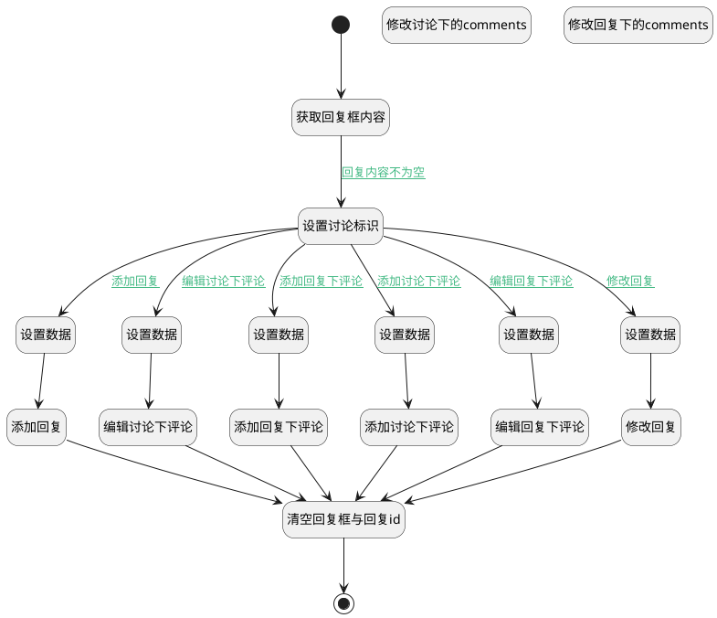

## 添加回复 <!-- {docsify-ignore-all} -->

   main_view页面统一回复、评论入口

### 处理过程




### 处理步骤说明

#### 开始 :id=Begin<sup class="footnote-symbol"> <font color=gray size=1>[开始]</font></sup>


#### 获取回复框内容 :id=RAWJSCODE1<sup class="footnote-symbol"> <font color=gray size=1>[直接前台代码]</font></sup>


<p class="panel-title"><b>执行代码</b></p>

```javascript
uiLogic.discuss_reply.content = uiLogic.view.layoutPanel.panelItems.field_textbox.value;
uiLogic.comment.content = uiLogic.view.layoutPanel.panelItems.field_textbox.value;
```

#### 设置讨论标识 :id=PREPAREJSPARAM1<sup class="footnote-symbol"> <font color=gray size=1>[准备参数]</font></sup>


1. 将`view(当前视图对象).layoutPanel.panelItems.field_textbox.editor` 设置给  `editor(编辑器)`

#### 设置数据 :id=PREPAREJSPARAM4<sup class="footnote-symbol"> <font color=gray size=1>[准备参数]</font></sup>


1. 将`ctx(应用上下文变量).discuss_post` 设置给  `discuss_reply(讨论回复).post_id`

#### 设置数据 :id=PREPAREJSPARAM3<sup class="footnote-symbol"> <font color=gray size=1>[准备参数]</font></sup>


1. 将`view(当前视图对象).operation_id` 设置给  `discuss_reply(讨论回复).id`
2. 将`view(当前视图对象).operation_id` 设置给  `ctx(应用上下文变量).discuss_reply`
3. 将`ctx(应用上下文变量).discuss_post` 设置给  `discuss_reply(讨论回复).post_id`

#### 设置数据 :id=PREPAREJSPARAM5<sup class="footnote-symbol"> <font color=gray size=1>[准备参数]</font></sup>


1. 将`ctx(应用上下文变量).discuss_post` 设置给  `comment(评论对象).principal_id`

#### 设置数据 :id=PREPAREJSPARAM6<sup class="footnote-symbol"> <font color=gray size=1>[准备参数]</font></sup>


1. 将`view(当前视图对象).operation_id` 设置给  `comment(评论对象).comment_id`

#### 设置数据 :id=PREPAREJSPARAM7<sup class="footnote-symbol"> <font color=gray size=1>[准备参数]</font></sup>


1. 将`view(当前视图对象).operation_id` 设置给  `comment(评论对象).principal_id`
2. 将`view(当前视图对象).operation_id` 设置给  `ctx(应用上下文变量).discuss_reply`

#### 设置数据 :id=PREPAREJSPARAM8<sup class="footnote-symbol"> <font color=gray size=1>[准备参数]</font></sup>


1. 将`view(当前视图对象).operation_id` 设置给  `comment(评论对象).comment_id`
2. 将`view(当前视图对象).reply_id` 设置给  `ctx(应用上下文变量).discuss_reply`

#### 添加回复 :id=DEACTION2<sup class="footnote-symbol"> <font color=gray size=1>[实体行为]</font></sup>


调用实体 [讨论回复(DISCUSS_REPLY)](module/Team/discuss_reply.md) 行为 [添加回复(add_reply)](module/Team/discuss_reply#行为) ，行为参数为`discuss_reply(讨论回复)`

#### 修改回复 :id=DEACTION3<sup class="footnote-symbol"> <font color=gray size=1>[实体行为]</font></sup>


调用实体 [讨论回复(DISCUSS_REPLY)](module/Team/discuss_reply.md) 行为 [编辑回复(edit_reply)](module/Team/discuss_reply#行为) ，行为参数为`discuss_reply(讨论回复)`

#### 添加讨论下评论 :id=DEACTION4<sup class="footnote-symbol"> <font color=gray size=1>[实体行为]</font></sup>


调用实体 [讨论(DISCUSS_POST)](module/Team/discuss_post.md) 行为 [添加评论(send_comment)](module/Team/discuss_post#行为) ，行为参数为`comment(评论对象)`

#### 编辑讨论下评论 :id=DEACTION5<sup class="footnote-symbol"> <font color=gray size=1>[实体行为]</font></sup>


调用实体 [讨论(DISCUSS_POST)](module/Team/discuss_post.md) 行为 [修改评论(update_comment)](module/Team/discuss_post#行为) ，行为参数为`comment(评论对象)`

#### 添加回复下评论 :id=DEACTION6<sup class="footnote-symbol"> <font color=gray size=1>[实体行为]</font></sup>


调用实体 [讨论回复(DISCUSS_REPLY)](module/Team/discuss_reply.md) 行为 [发送评论(send_comment)](module/Team/discuss_reply#行为) ，行为参数为`comment(评论对象)`

#### 编辑回复下评论 :id=DEACTION7<sup class="footnote-symbol"> <font color=gray size=1>[实体行为]</font></sup>


调用实体 [讨论回复(DISCUSS_REPLY)](module/Team/discuss_reply.md) 行为 [修改评论(update_comment)](module/Team/discuss_reply#行为) ，行为参数为`comment(评论对象)`

#### 修改讨论下的comments :id=RAWJSCODE3<sup class="footnote-symbol"> <font color=gray size=1>[直接前台代码]</font></sup>


<p class="panel-title"><b>执行代码</b></p>

```javascript
debugger;
var comments_control = uiLogic.view.layoutPanel.panelItems.form.control.formItems.find(item => item.name == "comments").editor;
var comment = uiLogic.comment;
if (view.operation_type == "send_post_comment") {
    comments_control.addItem(comment);
} else if (view.operation_type == "edit_post_comment") {
    comments_control.deleteItem(comment.comment_id);
    comments_control.addItem(comment);
}
```

#### 修改回复下的comments :id=RAWJSCODE4<sup class="footnote-symbol"> <font color=gray size=1>[直接前台代码]</font></sup>


<p class="panel-title"><b>执行代码</b></p>

```javascript
null
```

#### 清空回复框与回复id :id=RAWJSCODE2<sup class="footnote-symbol"> <font color=gray size=1>[直接前台代码]</font></sup>


<p class="panel-title"><b>执行代码</b></p>

```javascript
uiLogic.view.layoutPanel.panelItems.field_textbox.value = '';
uiLogic.view.layoutPanel.panelItems.field_textbox.data.field_textbox = '';
uiLogic.view.operation_type = null;
uiLogic.view.operation_id = null;
uiLogic.view.reply_id = null;
uiLogic.editor.reply.value = null;
uiLogic.editor.toggleCollapse(false)

```

#### 结束 :id=END1<sup class="footnote-symbol"> <font color=gray size=1>[结束]</font></sup>


### 连接条件说明
#### 回复内容不为空 :id=RAWJSCODE1-PREPAREJSPARAM1

```discuss_reply(讨论回复).content``` ISNOTNULL
#### 添加回复 :id=PREPAREJSPARAM1-PREPAREJSPARAM4

```view(当前视图对象).operation_type``` ISNULL AND ```view(当前视图对象).operation_id``` ISNULL
#### 修改回复 :id=PREPAREJSPARAM1-PREPAREJSPARAM3

```view(当前视图对象).operation_type``` EQ ```edit_reply``` AND ```view(当前视图对象).operation_id``` ISNOTNULL
#### 添加讨论下评论 :id=PREPAREJSPARAM1-PREPAREJSPARAM5

```view(当前视图对象).operation_type``` EQ ```send_post_comment``` AND ```view(当前视图对象).operation_id``` ISNULL
#### 编辑讨论下评论 :id=PREPAREJSPARAM1-PREPAREJSPARAM6

```view(当前视图对象).operation_type``` EQ ```edit_post_comment``` AND ```view(当前视图对象).operation_id``` ISNOTNULL
#### 添加回复下评论 :id=PREPAREJSPARAM1-PREPAREJSPARAM7

```view(当前视图对象).operation_type``` EQ ```send_reply_comment``` AND ```view(当前视图对象).operation_id``` ISNOTNULL
#### 编辑回复下评论 :id=PREPAREJSPARAM1-PREPAREJSPARAM8

```view(当前视图对象).operation_type``` EQ ```edit_reply_comment``` AND ```view(当前视图对象).operation_id``` ISNOTNULL


### 实体逻辑参数

|    中文名   |    代码名    |  数据类型      |备注 |
| --------| --------| --------  | --------   |
|评论对象|comment|数据对象||
|应用上下文变量|ctx|导航视图参数绑定参数||
|编辑器|editor|数据对象||
|当前视图对象|view|当前视图对象||
|传入变量(<i class="fa fa-check"/></i>)|Default|数据对象||
|讨论回复|discuss_reply|数据对象||
