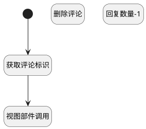

## 删除讨论下评论 <!-- {docsify-ignore-all} -->

   删除评论

### 处理过程




### 处理步骤说明

#### 开始 :id=Begin<sup class="footnote-symbol"> <font color=gray size=1>[开始]</font></sup>


#### 获取评论标识 :id=PREPAREJSPARAM1<sup class="footnote-symbol"> <font color=gray size=1>[准备参数]</font></sup>


1. 将`Default(传入变量).id` 设置给  `comment(评论).del_comment_id`
2. 将`Default(传入变量).id` 设置给  `comment_key(评论标识)`
3. 将`ctrl(当前部件对象).details.comments.editor` 设置给  `comments_controller(评论组件控制器)`

#### 删除评论 :id=DEACTION1<sup class="footnote-symbol"> <font color=gray size=1>[实体行为]</font></sup>


调用实体 [讨论(DISCUSS_POST)](module/Team/discuss_post.md) 行为 [删除评论(del_comment)](module/Team/discuss_post#行为) ，行为参数为`comment(评论)`

#### 回复数量-1 :id=RAWJSCODE1<sup class="footnote-symbol"> <font color=gray size=1>[直接前台代码]</font></sup>


<p class="panel-title"><b>执行代码</b></p>

```javascript

var comment_count = uiLogic.ctrl.formItems.comment_count;
if (comment_count.value == 1) {
    uiLogic.ctrl.formItems.comments.state.visible = false;
    comment_count.value = 0;
    comment_count.state.visible = false;
} else {
    comment_count.value = comment_count.value - 1;
}
```

#### 视图部件调用 :id=VIEWCTRLINVOKE1<sup class="footnote-symbol"> <font color=gray size=1>[视图部件调用]</font></sup>


调用`comments_controller(评论组件控制器)`的方法`deleteItem`，参数为`comment_key(评论标识)`


### 实体逻辑参数

|    中文名   |    代码名    |  数据类型      |备注 |
| --------| --------| --------  | --------   |
|评论标识|comment_key|简单数据||
|评论组件控制器|comments_controller|部件对象||
|传入变量(<i class="fa fa-check"/></i>)|Default|数据对象||
|评论|comment|数据对象||
|当前部件对象|ctrl|当前部件对象||
