## 编辑讨论下评论 <!-- {docsify-ignore-all} -->

   

### 处理过程

```plantuml
@startuml
hide footbox
<style>
root {
  HyperlinkColor #42b983
}
</style>

hide empty description
state "开始" as Begin <<start>> [[$./edit_comment#begin {开始}]]
state "注入脚本代码" as RAWJSCODE1  [[$./edit_comment#rawjscode1 {注入脚本代码}]]
state "设置数据" as PREPAREJSPARAM1  [[$./edit_comment#preparejsparam1 {设置数据}]]


Begin --> PREPAREJSPARAM1
PREPAREJSPARAM1 --> RAWJSCODE1


@enduml
```




### 处理步骤说明

#### 开始 :id=Begin<sup class="footnote-symbol"> <font color=gray size=1>[开始]</font></sup>


#### 设置数据 :id=PREPAREJSPARAM1<sup class="footnote-symbol"> <font color=gray size=1>[准备参数]</font></sup>


1. 将`edit_post_comment` 设置给  `view.operation_type`
2. 将`Default(传入变量).id` 设置给  `view.operation_id`

#### 注入脚本代码 :id=RAWJSCODE1<sup class="footnote-symbol"> <font color=gray size=1>[直接前台代码]</font></sup>


<p class="panel-title"><b>执行代码</b></p>

```javascript
// 获取底部编辑器，设置打开状态并设置值

var editor = uiLogic.view.layoutPanel.panelItems.field_textbox.editor;
editor.toggleCollapse(true);
editor.setValue(uiLogic.default.content);
```


### 实体逻辑参数

|    中文名   |    代码名    |  数据类型      |备注 |
| --------| --------| --------  | --------   |
|评论|comment|数据对象||
|传入变量(<i class="fa fa-check"/></i>)|Default|数据对象||
|上下文变量|ctx|导航视图参数绑定参数||
|评论部件控制器|comments_controller|部件对象||
|当前部件对象|ctrl|当前部件对象||
|view|view|当前视图对象||
