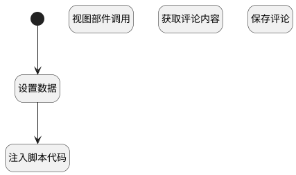

## 发送讨论下评论 <!-- {docsify-ignore-all} -->

   发送评论

### 处理过程




### 处理步骤说明

#### 开始 :id=Begin<sup class="footnote-symbol"> <font color=gray size=1>[开始]</font></sup>


#### 设置数据 :id=PREPAREJSPARAM2<sup class="footnote-symbol"> <font color=gray size=1>[准备参数]</font></sup>


1. 将`send_post_comment` 设置给  `view.operation_type`

#### 获取评论内容 :id=PREPAREJSPARAM1<sup class="footnote-symbol"> <font color=gray size=1>[准备参数]</font></sup>


1. 将`ctx(上下文变量).discuss_post` 设置给  `comment(评论).principal_id`
2. 将`ctrl(当前部件对象).details.comments.editor` 设置给  `comments_controller(评论部件控制器)`
3. 将`Default(传入变量).value` 设置给  `comment(评论).content`

#### 注入脚本代码 :id=RAWJSCODE1<sup class="footnote-symbol"> <font color=gray size=1>[直接前台代码]</font></sup>


<p class="panel-title"><b>执行代码</b></p>

```javascript
// 获取底部编辑器，设置打开状态并设置空值

var editor = uiLogic.view.layoutPanel.panelItems.field_textbox.editor;
editor.toggleCollapse(true);
editor.setValue(" ");
```

#### 保存评论 :id=DEACTION1<sup class="footnote-symbol"> <font color=gray size=1>[实体行为]</font></sup>


调用实体 [讨论(DISCUSS_POST)](module/Team/discuss_post.md) 行为 [添加评论(send_comment)](module/Team/discuss_post#行为) ，行为参数为`comment(评论)`

将执行结果返回给参数`comment(评论)`

#### 视图部件调用 :id=VIEWCTRLINVOKE1<sup class="footnote-symbol"> <font color=gray size=1>[视图部件调用]</font></sup>


调用`comments_controller(评论部件控制器)`的方法`addItem`，参数为`comment(评论)`


### 实体逻辑参数

|    中文名   |    代码名    |  数据类型      |备注 |
| --------| --------| --------  | --------   |
|评论部件控制器|comments_controller|部件对象||
|传入变量(<i class="fa fa-check"/></i>)|Default|数据对象||
|上下文变量|ctx|导航视图参数绑定参数||
|评论|comment|数据对象||
|view|view|当前视图对象||
|当前部件对象|ctrl|当前部件对象||
