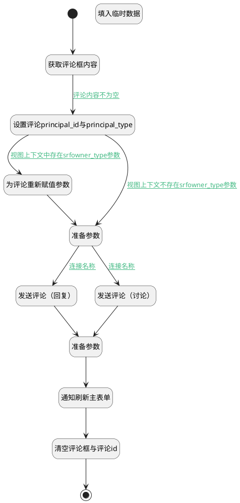

## 发送评论（移动端讨论） <!-- {docsify-ignore-all} -->

   发送评论，并关闭评论输入框

### 处理过程




### 处理步骤说明

#### 开始 :id=Begin<sup class="footnote-symbol"> <font color=gray size=1>[开始]</font></sup>


#### 获取评论框内容 :id=RAWJSCODE1<sup class="footnote-symbol"> <font color=gray size=1>[直接前台代码]</font></sup>


<p class="panel-title"><b>执行代码</b></p>

```javascript
uiLogic.comment.content = uiLogic.view.layoutPanel.panelItems.field_textbox1.value;
```

#### 设置评论principal_id与principal_type :id=PREPAREJSPARAM1<sup class="footnote-symbol"> <font color=gray size=1>[准备参数]</font></sup>


1. 将`ctx(应用上下文变量).principal_id` 设置给  `comment(评论对象).principal_id`
2. 将`ctx(应用上下文变量).principal_type` 设置给  `comment(评论对象).principal_type`
3. 将`view(当前视图对象).layoutPanel.panelItems.field_textbox1.editor` 设置给  `editor(编辑器)`
4. 将`ctx(应用上下文变量).principal_type` 设置给  `comment(评论对象).owner_type`

#### 为评论重新赋值参数 :id=PREPAREJSPARAM6<sup class="footnote-symbol"> <font color=gray size=1>[准备参数]</font></sup>


1. 将`ctx(应用上下文变量).srfowner_type` 设置给  `comment(评论对象).owner_type`
2. 将`ctx(应用上下文变量).srfowner_type` 设置给  `comment(评论对象).principal_type`

#### 准备参数 :id=PREPAREJSPARAM9<sup class="footnote-symbol"> <font color=gray size=1>[准备参数]</font></sup>


1. 将`comment(评论对象).content` 设置给  `Default(传入变量).content`
2. 将`comment(评论对象).principal_id` 设置给  `Default(传入变量).principal_id`

#### 发送评论（讨论） :id=DEACTION4<sup class="footnote-symbol"> <font color=gray size=1>[实体行为]</font></sup>


调用实体 [讨论(DISCUSS_POST)](module/Team/discuss_post.md) 行为 [添加评论(send_comment)](module/Team/discuss_post#行为) ，行为参数为`Default(传入变量)`

将执行结果返回给参数`Default(传入变量)`

#### 发送评论（回复） :id=DEACTION5<sup class="footnote-symbol"> <font color=gray size=1>[实体行为]</font></sup>


调用实体 [讨论回复(DISCUSS_REPLY)](module/Team/discuss_reply.md) 行为 [发送评论(send_comment)](module/Team/discuss_reply#行为) ，行为参数为`Default(传入变量)`

将执行结果返回给参数`Default(传入变量)`

#### 准备参数 :id=PREPAREJSPARAM10<sup class="footnote-symbol"> <font color=gray size=1>[准备参数]</font></sup>


1. 将`Default(传入变量).create_man` 设置给  `comment(评论对象).create_man`
2. 将`Default(传入变量).create_time` 设置给  `comment(评论对象).create_time`
3. 将`Default(传入变量).update_man` 设置给  `comment(评论对象).update_man`
4. 将`Default(传入变量).update_time` 设置给  `comment(评论对象).update_time`
5. 将`Default(传入变量).id` 设置给  `comment(评论对象).id`

#### 通知刷新主表单 :id=RAWJSCODE5<sup class="footnote-symbol"> <font color=gray size=1>[直接前台代码]</font></sup>


<p class="panel-title"><b>执行代码</b></p>

```javascript
ibiz.mc.command.update.send({ srfdecodename: context.principal_type,srfkey: context.principal_id})
```

#### 填入临时数据 :id=RAWJSCODE4<sup class="footnote-symbol"> <font color=gray size=1>[直接前台代码]</font></sup>


<p class="panel-title"><b>执行代码</b></p>

```javascript
ibiz.hub.getApp(context.srfappid).deService.exec(
    'plmmob.comment',
    'Create',
    context,
    uiLogic.comment,
);

```

#### 清空评论框与评论id :id=RAWJSCODE2<sup class="footnote-symbol"> <font color=gray size=1>[直接前台代码]</font></sup>


<p class="panel-title"><b>执行代码</b></p>

```javascript
uiLogic.view.layoutPanel.panelItems.field_textbox1.value = '';
uiLogic.view.layoutPanel.panelItems.field_textbox.data.field_textbox1 = '';
uiLogic.view.edit_comment_id = null;
uiLogic.view.reply_comment_id = null;
uiLogic.editor.clearReply();
view.layoutPanel.panelItems.send_comment_container.state.visible=false;
view.layoutPanel.panelItems.comment_container.state.visible=true;

```

#### 结束 :id=END1<sup class="footnote-symbol"> <font color=gray size=1>[结束]</font></sup>


### 连接条件说明
#### 评论内容不为空 :id=RAWJSCODE1-PREPAREJSPARAM1

```comment(评论对象).content``` ISNOTNULL
#### 视图上下文中存在srfowner_type参数 :id=PREPAREJSPARAM1-PREPAREJSPARAM6

```ctx(应用上下文变量).srfowner_type``` ISNOTNULL
#### 连接名称 :id=PREPAREJSPARAM9-DEACTION4

```ctx(应用上下文变量).principal_type``` EQ ```discuss_post```
#### 连接名称 :id=PREPAREJSPARAM9-DEACTION5

```ctx(应用上下文变量).principal_type``` EQ ```discuss_reply```
#### 视图上下文不存在srfowner_type参数 :id=PREPAREJSPARAM1-PREPAREJSPARAM9

```ctx(应用上下文变量).srfowner_type``` ISNULL


### 实体逻辑参数

|    中文名   |    代码名    |  数据类型      |备注 |
| --------| --------| --------  | --------   |
|应用上下文变量|ctx|导航视图参数绑定参数||
|当前视图对象|view|当前视图对象||
|传入变量(<i class="fa fa-check"/></i>)|Default|数据对象||
|评论对象|comment|数据对象||
|编辑器|editor|数据对象||
