## 发送回复下评论 <!-- {docsify-ignore-all} -->

   添加回复的评论，展开底部输入框
reply实体列表使用

### 处理过程

```plantuml
@startuml
hide footbox
<style>
root {
  HyperlinkColor #42b983
}
</style>

hide empty description
state "开始" as Begin <<start>> [[$./send_reply_comment#begin {开始}]]
state "展开评论输入框并设值" as RAWJSCODE1  [[$./send_reply_comment#rawjscode1 {展开评论输入框并设值}]]
state "设置回复id" as PREPAREJSPARAM1  [[$./send_reply_comment#preparejsparam1 {设置回复id}]]


Begin --> PREPAREJSPARAM1
PREPAREJSPARAM1 --> RAWJSCODE1


@enduml
```




### 处理步骤说明

#### 开始 :id=Begin<sup class="footnote-symbol"> <font color=gray size=1>[开始]</font></sup>


#### 设置回复id :id=PREPAREJSPARAM1<sup class="footnote-symbol"> <font color=gray size=1>[准备参数]</font></sup>


1. 将`view(当前视图对象).parentView` 设置给  `parentView(父视图对象)`
2. 将`Default(传入变量).id` 设置给  `parentView(父视图对象).operation_id`
3. 将`send_reply_comment` 设置给  `parentView(父视图对象).operation_type`
4. 将`parentView(父视图对象).layoutPanel.panelItems.field_textbox.editor` 设置给  `editor(回复对象)`

#### 展开评论输入框并设值 :id=RAWJSCODE1<sup class="footnote-symbol"> <font color=gray size=1>[直接前台代码]</font></sup>


<p class="panel-title"><b>执行代码</b></p>

```javascript

uiLogic.editor.toggleCollapse(true);
uiLogic.editor.setValue(" ");
```


### 实体逻辑参数

|    中文名   |    代码名    |  数据类型      |备注 |
| --------| --------| --------  | --------   |
|传入变量(<i class="fa fa-check"/></i>)|Default|数据对象||
|父视图对象|parentView|数据对象||
|当前视图对象|view|当前视图对象||
|回复对象|editor|数据对象||
