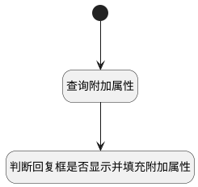

## 讨论关闭时隐藏回复输入框 <!-- {docsify-ignore-all} -->

   讨论关闭时隐藏回复输入框

### 处理过程




### 处理步骤说明

#### 开始 :id=Begin<sup class="footnote-symbol"> <font color=gray size=1>[开始]</font></sup>


#### 查询附加属性 :id=DEACTION1<sup class="footnote-symbol"> <font color=gray size=1>[实体行为]</font></sup>


调用实体 [讨论(DISCUSS_POST)](module/Team/discuss_post.md) 行为 [填充附加数据(fill_addition)](module/Team/discuss_post#行为) ，行为参数为`Default(传入变量)`

将执行结果返回给参数`Default(传入变量)`

#### 判断回复框是否显示并填充附加属性 :id=RAWJSCODE1<sup class="footnote-symbol"> <font color=gray size=1>[直接前台代码]</font></sup>


<p class="panel-title"><b>执行代码</b></p>

```javascript
const panel = view.layoutPanel.panelItems; // 视图面板对象
// 回复框是否显示
panel.container_comment.state.visible = (panel.form.control.state.data.status == '1');
panel.form.control.state.data.discuss_num = uiLogic.default.discuss_num;
panel.form.control.state.data.reply_num = uiLogic.default.reply_num;
```


### 实体逻辑参数

|    中文名   |    代码名    |  数据类型      |备注 |
| --------| --------| --------  | --------   |
|当前视图对象|view|当前视图对象||
|传入变量(<i class="fa fa-check"/></i>)|Default|数据对象||
