## 添加回复 <!-- {docsify-ignore-all} -->

   添加回复

### 处理过程

```plantuml
@startuml
hide empty description
<style>
root {
  HyperlinkColor #42b983
}
</style>

hide empty description
state "开始" as Begin <<start>> [[$./add_reply#begin {"开始"}]]
state "填充回复内容" as PREPAREPARAM1  [[$./add_reply#prepareparam1 {"填充回复内容"}]]
state "添加回复" as DEACTION1  [[$./add_reply#deaction1 {"添加回复"}]]
state "讨论热度+5" as RAWSQLCALL1  [[$./add_reply#rawsqlcall1 {"讨论热度+5"}]]
state "结束" as END1 <<end>> [[$./add_reply#end1 {"结束"}]]


Begin --> PREPAREPARAM1
PREPAREPARAM1 --> DEACTION1
DEACTION1 --> RAWSQLCALL1
RAWSQLCALL1 --> END1


@enduml
```




### 处理步骤说明

#### 开始 :id=Begin<sup class="footnote-symbol"> <font color=gray size=1>[开始]</font></sup>


*- N/A*
#### 填充回复内容 :id=PREPAREPARAM1<sup class="footnote-symbol"> <font color=gray size=1>[准备参数]</font></sup>


1. 将`Default(传入变量).CONTENT(回复内容)` 设置给  `create_obj(新建对象).CONTENT(回复内容)`
2. 将`Default(传入变量).POST_ID(讨论标识)` 设置给  `create_obj(新建对象).POST_ID(讨论标识)`

#### 添加回复 :id=DEACTION1<sup class="footnote-symbol"> <font color=gray size=1>[实体行为]</font></sup>


调用实体 [讨论回复(DISCUSS_REPLY)](module/Team/discuss_reply.md) 行为 [Create](module/Team/discuss_reply#行为) ，行为参数为`create_obj(新建对象)`

#### 讨论热度+5 :id=RAWSQLCALL1<sup class="footnote-symbol"> <font color=gray size=1>[直接SQL调用]</font></sup>


<p class="panel-title"><b>执行sql语句</b></p>

```sql
update discuss_post t1 set t1.heat = t1.heat + 5 
where t1.id = ?
```

<p class="panel-title"><b>执行sql参数</b></p>

1. `Default(传入变量).POST_ID(讨论标识)`


#### 结束 :id=END1<sup class="footnote-symbol"> <font color=gray size=1>[结束]</font></sup>


*- N/A*


### 实体逻辑参数

|    中文名   |    代码名    |  数据类型    |  实体   |备注 |
| --------| --------| -------- | -------- | --------   |
|传入变量(<i class="fa fa-check"/></i>)|Default|数据对象|[讨论回复(DISCUSS_REPLY)](module/Team/discuss_reply.md)||
|新建对象|create_obj|数据对象|[讨论回复(DISCUSS_REPLY)](module/Team/discuss_reply.md)||
