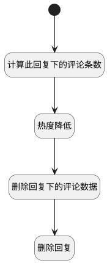

## 删除回复 <!-- {docsify-ignore-all} -->

   删除回复

### 处理过程




### 处理步骤说明

#### 开始 :id=Begin<sup class="footnote-symbol"> <font color=gray size=1>[开始]</font></sup>


*- N/A*
#### 计算此回复下的评论条数 :id=RAWSQLCALL2<sup class="footnote-symbol"> <font color=gray size=1>[直接SQL调用]</font></sup>


<p class="panel-title"><b>执行sql语句</b></p>

```sql
select count(1) as comment_num from `comment` where principal_id = ? and principal_type = 'DISCUSS_REPLY'
```

<p class="panel-title"><b>执行sql参数</b></p>

1. `Default(传入变量).ID(标识)`

重置参数`Default(传入变量)`，并将执行sql结果赋值给参数`Default(传入变量)`

#### 热度降低 :id=RAWSQLCALL3<sup class="footnote-symbol"> <font color=gray size=1>[直接SQL调用]</font></sup>


<p class="panel-title"><b>执行sql语句</b></p>

```sql
update discuss_post t1 set t1.heat = t1.heat - ((2 * ?) + 5)  
where exists(select 1 from discuss_reply t2 where t1.id = t2.post_id and t2.id = ?)
```

<p class="panel-title"><b>执行sql参数</b></p>

1. `Default(传入变量).comment_num(回复评论数)`
2. `Default(传入变量).ID(标识)`


#### 删除回复下的评论数据 :id=RAWSQLCALL1<sup class="footnote-symbol"> <font color=gray size=1>[直接SQL调用]</font></sup>


<p class="panel-title"><b>执行sql语句</b></p>

```sql
delete from `comment` where principal_id = ? and principal_type = 'DISCUSS_REPLY'
```

<p class="panel-title"><b>执行sql参数</b></p>

1. `Default(传入变量).ID(标识)`


#### 删除回复 :id=DEACTION1<sup class="footnote-symbol"> <font color=gray size=1>[实体行为]</font></sup>


调用实体 [讨论回复(DISCUSS_REPLY)](module/Team/discuss_reply.md) 行为 [Remove](module/Team/discuss_reply#行为) ，行为参数为`Default(传入变量)`


### 实体逻辑参数

|    中文名   |    代码名    |  数据类型    |  实体   |备注 |
| --------| --------| -------- | -------- | --------   |
|传入变量(<i class="fa fa-check"/></i>)|Default|数据对象|[讨论回复(DISCUSS_REPLY)](module/Team/discuss_reply.md)||
