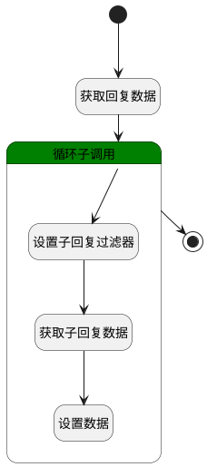

## 子回复数据 <!-- {docsify-ignore-all} -->

   设置回复的子回复

### 处理过程




### 处理步骤说明

#### 开始 :id=Begin<sup class="footnote-symbol"> <font color=gray size=1>[开始]</font></sup>


*- N/A*
#### 获取回复数据 :id=DEDATASET1<sup class="footnote-symbol"> <font color=gray size=1>[实体数据集]</font></sup>


调用实体 [讨论回复(DISCUSS_REPLY)](module/Team/discuss_reply.md) 数据集合 [数据集(DEFAULT)](module/Team/discuss_reply#数据集合) ，查询参数为`Default(传入变量)`

将执行结果返回给参数`result`

#### 循环子调用 :id=LOOPSUBCALL1<sup class="footnote-symbol"> <font color=gray size=1>[循环子调用]</font></sup>


循环参数`result`，子循环参数使用`reply_dto`
#### 设置子回复过滤器 :id=PREPAREPARAM1<sup class="footnote-symbol"> <font color=gray size=1>[准备参数]</font></sup>


1. 将`reply_dto.ID(标识)` 设置给  `subreply_filter.n_pid_eq`

#### 获取子回复数据 :id=DEDATASET2<sup class="footnote-symbol"> <font color=gray size=1>[实体数据集]</font></sup>


调用实体 [讨论回复(DISCUSS_REPLY)](module/Team/discuss_reply.md) 数据集合 [数据集(DEFAULT)](module/Team/discuss_reply#数据集合) ，查询参数为`subreply_filter`

将执行结果返回给参数`subreply_page`

#### 设置数据 :id=RAWSFCODE1<sup class="footnote-symbol"> <font color=gray size=1>[直接后台代码]</font></sup>


<p class="panel-title"><b>执行代码[Groovy]</b></p>

```groovy
def sub_replys = logic.param("subreply_page").getReal();

entity.set('sub_replys', sub_replys.getContent());
```

#### 结束 :id=END1<sup class="footnote-symbol"> <font color=gray size=1>[结束]</font></sup>


返回 `result`


### 实体逻辑参数

|    中文名   |    代码名    |  数据类型    |  实体   |备注 |
| --------| --------| -------- | -------- | --------   |
|传入变量(<i class="fa fa-check"/></i>)|Default|过滤器|||
|reply_dto|reply_dto|数据对象|[讨论回复(DISCUSS_REPLY)](module/Team/discuss_reply.md)||
|result|result|分页查询|||
|subreply_filter|subreply_filter|过滤器|||
|subreply_page|subreply_page|分页查询|||
