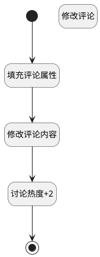

## 回复下修改评论 <!-- {docsify-ignore-all} -->

   回复下修改评论

### 处理过程




### 处理步骤说明

#### 开始 :id=Begin<sup class="footnote-symbol"> <font color=gray size=1>[开始]</font></sup>


*- N/A*
#### 填充评论属性 :id=PREPAREPARAM1<sup class="footnote-symbol"> <font color=gray size=1>[准备参数]</font></sup>


1. 将`Default(传入变量).comment_id` 设置给  `comment(评论对象).ID(标识)`
2. 将`Default(传入变量).content(回复内容)` 设置给  `comment(评论对象).CONTENT(内容)`

#### 修改评论 :id=DEACTION1<sup class="footnote-symbol"> <font color=gray size=1>[实体行为]</font></sup>


调用实体 [评论(COMMENT)](module/Base/comment.md) 行为 [Update](module/Base/comment#行为) ，行为参数为`comment(评论对象)`

将执行结果返回给参数`comment(评论对象)`

#### 修改评论内容 :id=RAWSQLCALL2<sup class="footnote-symbol"> <font color=gray size=1>[直接SQL调用]</font></sup>


<p class="panel-title"><b>执行sql语句</b></p>

```sql
update comment set CONTENT = ? where id = ?
```

<p class="panel-title"><b>执行sql参数</b></p>

1. `comment(评论对象).CONTENT(内容)`
2. `comment(评论对象).ID(标识)`


#### 讨论热度+2 :id=RAWSQLCALL1<sup class="footnote-symbol"> <font color=gray size=1>[直接SQL调用]</font></sup>


<p class="panel-title"><b>执行sql语句</b></p>

```sql
update discuss_post t1 set t1.heat = t1.heat + 2 
where t1.id = ?
```

<p class="panel-title"><b>执行sql参数</b></p>

1. `Default(传入变量).POST_ID(讨论标识)`


#### 结束 :id=END1<sup class="footnote-symbol"> <font color=gray size=1>[结束]</font></sup>


返回 `comment(评论对象)`


### 实体逻辑参数

|    中文名   |    代码名    |  数据类型    |  实体   |备注 |
| --------| --------| -------- | -------- | --------   |
|传入变量(<i class="fa fa-check"/></i>)|Default|数据对象|[讨论回复(DISCUSS_REPLY)](module/Team/discuss_reply.md)||
|评论对象|comment|数据对象|[评论(COMMENT)](module/Base/comment.md)||
