## 更新讨论时间 <!-- {docsify-ignore-all} -->

   

### 处理过程

```plantuml
@startuml
hide empty description
<style>
root {
  HyperlinkColor #42b983
}
</style>

hide empty description
state "开始" as Begin <<start>> [[$./update_post_time#begin {"开始"}]]
state "调试逻辑参数" as DEBUGPARAM1  [[$./update_post_time#debugparam1 {"调试逻辑参数"}]]
state "准备参数" as PREPAREPARAM1  [[$./update_post_time#prepareparam1 {"准备参数"}]]
state "更新讨论" as DEACTION1  [[$./update_post_time#deaction1 {"更新讨论"}]]


Begin --> DEBUGPARAM1
DEBUGPARAM1 --> PREPAREPARAM1
PREPAREPARAM1 --> DEACTION1


@enduml
```

### 处理步骤说明

#### 开始 :id=Begin [开始]

*- N/A*
#### 调试逻辑参数 :id=DEBUGPARAM1 [调试逻辑参数]

> [!NOTE|label:调试信息|icon:fa fa-bug]
> 调试输出参数`Default(传入变量)`的详细信息

#### 准备参数 :id=PREPAREPARAM1 [准备参数]

1. 将`Default(传入变量).POST_ID(讨论标识)` 设置给  `post_obj.ID(标识)`

#### 更新讨论 :id=DEACTION1 [实体行为]

调用实体 [讨论(DISCUSS_POST)](module/Team/discuss_post.md) 行为 [Update](module/Team/discuss_post#行为) ，行为参数为`post_obj`

### 实体逻辑参数

|    中文名   |    代码名    |  数据类型    |  实体   |备注 |
| --------| --------| -------- | -------- | --------   |
|传入变量(<i class="fa fa-check"/></i>)|Default|数据对象|[讨论回复(DISCUSS_REPLY)](module/Team/discuss_reply.md)||
|post_obj|post_obj|数据对象|[讨论(DISCUSS_POST)](module/Team/discuss_post.md)||
