## 获取回复列表条数 <!-- {docsify-ignore-all} -->

   获取回复列表条数

### 处理过程

```plantuml
@startuml
hide footbox
<style>
root {
  HyperlinkColor #42b983
}
</style>

hide empty description
state "开始" as Begin <<start>> [[$./get_reply_num#begin {开始}]]
state "获取回复列表条数" as RAWJSCODE1  [[$./get_reply_num#rawjscode1 {获取回复列表条数}]]


Begin --> RAWJSCODE1


@enduml
```




### 处理步骤说明

#### 开始 :id=Begin<sup class="footnote-symbol"> <font color=gray size=1>[开始]</font></sup>


#### 获取回复列表条数 :id=RAWJSCODE1<sup class="footnote-symbol"> <font color=gray size=1>[直接前台代码]</font></sup>


<p class="panel-title"><b>执行代码</b></p>

```javascript
const total = uiLogic.ctrl.state.total;
view.parentView.layoutPanel.panelItems.form.control.details.replys.model.caption = total + '个回复'
```


### 实体逻辑参数

|    中文名   |    代码名    |  数据类型      |备注 |
| --------| --------| --------  | --------   |
|传入变量(<i class="fa fa-check"/></i>)|Default|数据对象||
|当前部件对象|ctrl|当前部件对象||
